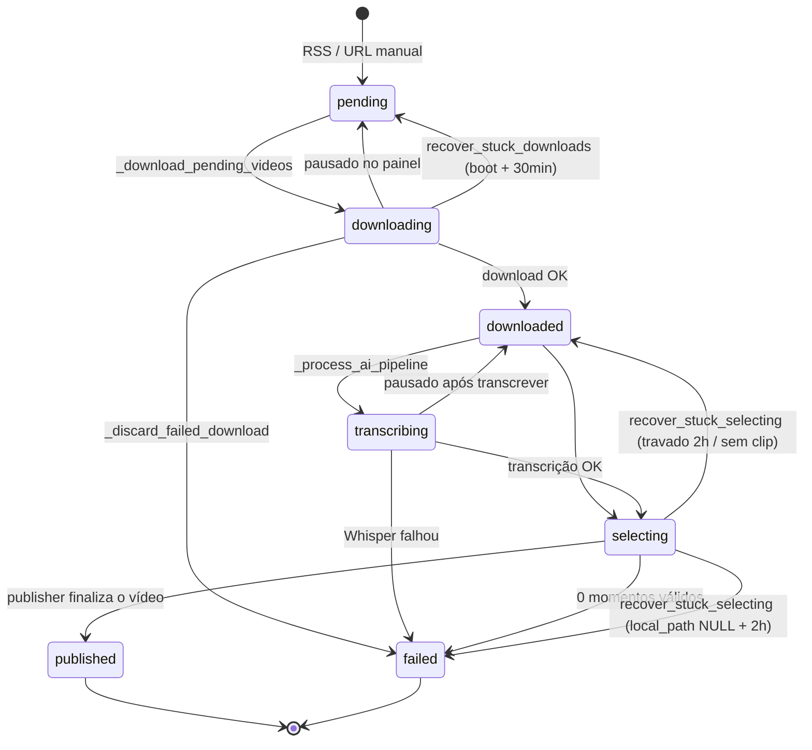
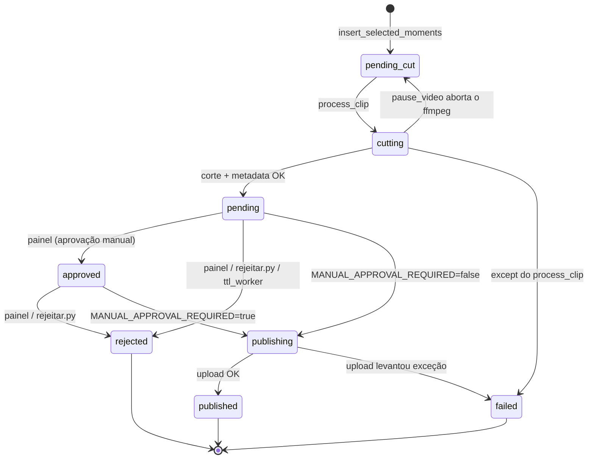

# Estados e transições do pipeline

Fonte de verdade da fila: **MySQL**, colunas `source_videos.status` e `generated_clips.status`.
O Redis **não** guarda fila (ver [`SISTEMA-CLIP-PROCESSOR.md`](SISTEMA-CLIP-PROCESSOR.md)).

Este documento existe porque estado preso já lotou o SSD: um vídeo travado segura o `.mp4` bruto em
disco **e** uma vaga da janela de download, e com as duas janelas cheias de linha morta o pipeline
para de baixar qualquer coisa. Incidente de 27/07/2026, detalhado em [`../CLAUDE.md`](../CLAUDE.md).

Verificado no código em **13/08/2026**.

---

## `source_videos.status`

ENUM completo em [`mysql/init/01-clips-schema.sql:30`](../mysql/init/01-clips-schema.sql#L30):
`pending`, `downloading`, `downloaded`, `transcribing`, `selecting`, `cutting`, `publishing`,
`published`, `failed`.

| De | Para | Quem escreve | Observação |
|---|---|---|---|
| — | `pending` | [`db.py:101`](../clip-processor/src/db.py#L101) `insert_video`; [`processar.py:139`](../clip-processor/src/processar.py#L139) | `INSERT IGNORE`, idempotente |
| `pending` | `downloading` | [`pipeline_runner.py:169`](../clip-processor/src/pipeline_runner.py#L169) | |
| `downloading` | `downloaded` | [`pipeline_runner.py:173`](../clip-processor/src/pipeline_runner.py#L173) | grava `local_path` |
| `downloading` | `pending` | [`pipeline_runner.py:183`](../clip-processor/src/pipeline_runner.py#L183) | só se o vídeo foi pausado durante o download |
| `downloading` | `failed` | [`pipeline_runner.py:110`](../clip-processor/src/pipeline_runner.py#L110) `_discard_failed_download` | apaga o arquivo e zera `local_path` |
| `downloaded` | `transcribing` | [`rss_poller.py:115`](../clip-processor/src/rss_poller.py#L115) | |
| `transcribing` | `failed` | [`rss_poller.py:119`](../clip-processor/src/rss_poller.py#L119) | transcrição sem fallback |
| `transcribing` | `downloaded` | [`rss_poller.py:124`](../clip-processor/src/rss_poller.py#L124) | pausado depois de transcrever |
| `transcribing` | `selecting` | [`rss_poller.py:130`](../clip-processor/src/rss_poller.py#L130) | |
| `selecting` | `failed` | [`rss_poller.py:148`](../clip-processor/src/rss_poller.py#L148) | IA devolveu 0 momentos |
| `selecting` | `published` | [`publisher.py:368`](../clip-processor/src/publisher.py#L368) | quando todos os clips terminam |

**`selecting` é o estado final de sucesso do ramo de IA.** Nada no ramo de ingestão o move adiante:
o vídeo fica em `selecting` enquanto os clips dele são cortados e publicados, e só vira `published`
lá no fim, pelo publisher.

### `cutting` e `publishing` em `source_videos`: valores mortos

Os dois estão no ENUM e `cutting` é lido como guard em
[`queue_controls.py:157`](../clip-processor/src/queue_controls.py#L157) (`can_delete_raw`), mas
**nenhum código escreve esses valores em `source_videos`**. Consequência prática: o guard de
"arquivo em uso" do sidecar nunca dispara por eles. É por isso que
[`pipeline_runner.py:90`](../clip-processor/src/pipeline_runner.py#L90) (`_clips_need_raw`) checa
`generated_clips.status` na mão em vez de confiar no status do vídeo.

---

## `generated_clips.status`

ENUM final em [`mysql/init/05-controle-manual-migration.sql:11`](../mysql/init/05-controle-manual-migration.sql#L11):
`pending_cut`, `pending`, `cutting`, `publishing`, `published`, `failed`, `approved`, `rejected`.
Default `pending_cut`.

| De | Para | Quem escreve | Observação |
|---|---|---|---|
| — | `pending_cut` | [`selector.py:298`](../clip-processor/src/selector.py#L298) `insert_selected_moments` | |
| `pending_cut` | `cutting` | [`video_processor.py:200`](../clip-processor/src/video_processor.py#L200) | |
| `cutting` | `pending` | [`video_processor.py:246`](../clip-processor/src/video_processor.py#L246) | após gravar `clip_path` e metadata |
| `cutting` | `failed` | [`video_processor.py:253`](../clip-processor/src/video_processor.py#L253) | qualquer exceção do FFmpeg/metadata |
| `cutting` | `pending_cut` | [`queue_controls.py:82`](../clip-processor/src/queue_controls.py#L82) | pause mata o ffmpeg e devolve pra fila |
| `pending` | `approved` | **só o painel** (`UPDATE` direto) | o Python nunca escreve `approved` |
| `pending`/`approved` | `rejected` | [`rejeitar.py:77`](../clip-processor/src/rejeitar.py#L77); [`ttl_worker.py:51`](../clip-processor/src/ttl_worker.py#L51) | `rejeitar` apaga o MP4 final e **preserva** o raw do vídeo fonte |
| publicável | `publishing` | [`publisher.py:275`](../clip-processor/src/publisher.py#L275) `_transition_to_publishing` | `UPDATE ... WHERE status=?` com guard de corrida |
| `publishing` | `published` | [`publisher.py:292`](../clip-processor/src/publisher.py#L292) | grava `youtube_video_id`, `published_at` |
| `publishing` | `failed` | [`publisher.py:303`](../clip-processor/src/publisher.py#L303) | motivo em `upload_error` (2000 chars) |

**Qual estado é "publicável" depende de env var.**
[`publisher.py:21`](../clip-processor/src/publisher.py#L21) `_publishable_status()`:
`MANUAL_APPROVAL_REQUIRED=true` ⇒ só `approved`; qualquer outro valor (default `false`) ⇒ publica
`pending` direto, sem revisão humana.

---

## Recuperação automática: o que tem e o que não tem

`run_recovery_once` ([`main.py:51`](../clip-processor/src/main.py#L51)) roda **no boot**
([`main.py:153`](../clip-processor/src/main.py#L153)) **e como job periódico a cada 30 min**
(job id `state_recovery`, [`main.py:127`](../clip-processor/src/main.py#L127)). Antes de 13/08/2026
rodava só no boot — o que travasse depois do container subir ficava preso até o próximo restart,
na prática dias. Falha do recovery é logada e engolida de propósito
([`main.py:67`](../clip-processor/src/main.py#L67)): também cobre a janela do `Errno 111`
(clip-processor sobe antes do MySQL), em que o recovery de boot morre no `except`.

| Estado | Recuperação | Onde |
|---|---|---|
| `source_videos.downloading` | ✅ → `pending`, sem condição de tempo | [`db.py:127`](../clip-processor/src/db.py#L127) |
| `source_videos.selecting`, com arquivo, sem update há 2h | ✅ → `downloaded` (reprocessa a IA) | [`db.py:183`](../clip-processor/src/db.py#L183) |
| `source_videos.selecting`, com arquivo, sem nenhum clip gerado | ✅ → `downloaded`, imediato (não espera 2h) | [`db.py:190`](../clip-processor/src/db.py#L190) |
| `source_videos.selecting`, `local_path IS NULL`, sem update há 2h | ✅ → `failed` | [`db.py:200`](../clip-processor/src/db.py#L200) |
| `source_videos.transcribing` | ❌ **nenhuma** | — |
| `generated_clips.cutting` | ❌ **nenhuma** | — |
| `generated_clips.publishing` | ❌ **nenhuma** | — |

`SELECTING_STUCK_HOURS = 2` em [`db.py:153`](../clip-processor/src/db.py#L153). A cadência de 30 min
do job é menor que isso de propósito: pega o travamento pouco depois de ele passar do limite.

### A terceira query (`local_path IS NULL` → `failed`)

Acrescentada em 13/08/2026. A limpeza de disco (`delete_source_video_file` e `purge_old_videos` no
sidecar) zera `local_path` **sem tocar em `status`**. O registro ficava num estado que as duas
primeiras queries nunca alcançavam — as duas exigem `local_path IS NOT NULL` — e nenhum restart
resolvia. Sem o raw em disco não existe seleção para reprocessar, então o destino honesto é `failed`:
libera a vaga da janela e mantém o registro no banco com os clips que já tinham sido gerados.

### O que fazer com o que não tem recuperação

`transcribing`, `cutting` e `publishing` travados ficam presos para sempre. Diagnóstico e destrave
manual em [`RUNBOOK.md`](RUNBOOK.md#estado-preso-sem-recuperação-automática).

---

## Estados × ocupação da janela de download

A janela conta vídeos "ocupando disco" por formato
([`pipeline_runner.py:57`](../clip-processor/src/pipeline_runner.py#L57)). Um vídeo ocupa vaga se
**qualquer** uma destas for verdadeira:

- `source_videos.local_path IS NOT NULL`, **ou**
- `source_videos.status` em `downloading`, `downloaded`, `transcribing`, `selecting`, `cutting`, `publishing`, **ou**
- tem clip em `pending_cut`, `pending`, `cutting` ou `approved`.

Por isso `failed` com `local_path` preenchido travava o pipeline: satisfazia a primeira condição
para sempre. Foi o que `_discard_failed_download` resolveu — 58 vídeos `failed` seguravam 4.1 GB e
zeraram o déficit de download.

`published` e `rejected` não ocupam vaga. `failed` só ocupa se `local_path` ainda estiver preenchido.

---

## Estados terminais e o que sobra em disco

| Estado terminal | Raw do vídeo fonte | Clip final |
|---|---|---|
| `source_videos.published` | apagado por [`publisher.py:331`](../clip-processor/src/publisher.py#L331) | apagado por [`publisher.py:345`](../clip-processor/src/publisher.py#L345), com `clip_path`/`thumbnail_path` zerados |
| `source_videos.failed` (download) | apagado por `_discard_failed_download` | não existe |
| `source_videos.failed` (IA) | **fica em disco**, `local_path` preenchido | não existe |
| `generated_clips.rejected` via `rejeitar.py` | **preservado de propósito** (permite recorte futuro) | MP4 apagado |
| `generated_clips.failed` | fica com o vídeo fonte | intermediários podem sobrar |

`_maybe_finalize_source_video` ([`publisher.py:314`](../clip-processor/src/publisher.py#L314)) só
roda quando **nenhum** clip do vídeo está em estado não-terminal (`pending_cut`, `cutting`,
`pending`, `approved`, `publishing` — lista em
[`publisher.py:18`](../clip-processor/src/publisher.py#L18)) **e** ao menos um publicou. Se nenhum
clip publicou, nada é apagado e o raw fica.
