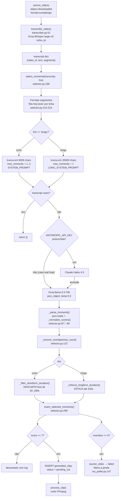

# Sistema — IA de seleção de cortes

Como o pipeline decide **quais trechos** de um vídeo viram clip. Qual modelo faz isso, com que
prompt, com que regras de duração, e onde mexer.

Código-fonte único desta decisão: [`clip-processor/src/selector.py`](../clip-processor/src/selector.py).
Módulo irmão, mesmo subsistema de IA: [`clip-processor/src/metadata_generator.py`](../clip-processor/src/metadata_generator.py).

Estado as-built em **13/08/2026**. Para o mapa geral do daemon, ver [`SISTEMA-CLIP-PROCESSOR.md`](SISTEMA-CLIP-PROCESSOR.md).

---

## 1. Qual IA, e por quê

### Nota de nomenclatura: Groq ≠ Grok

Confusão que já causou mal-entendido aqui:

| Nome | O que é | Usado no projeto? |
|---|---|---|
| **Groq** | Empresa de inferência (hardware LPU). Serve modelos abertos — LLaMA, Whisper — via API compatível com OpenAI. Tem free tier. | **Sim.** É quem responde hoje, tanto na seleção quanto na transcrição. |
| **Grok** | Modelo de linguagem da xAI (Elon Musk). | **Não.** Não existe nenhuma referência a xAI/Grok no código. |

Quando este documento diz "Groq", é a empresa de inferência rodando **LLaMA 3.3-70b da Meta**.

### Cadeia de fallback

`select_moments()` ([`selector.py:188`](../clip-processor/src/selector.py#L188)) tenta providers em ordem:

| # | Provider | Modelo | Onde a key é lida | Condição |
|---|---|---|---|---|
| 1 | Anthropic | `claude-haiku-4-5` | `os.environ['ANTHROPIC_API_KEY']` — [`selector.py:249`](../clip-processor/src/selector.py#L249) | Só tenta se a env existir e não estiver vazia (`.strip()`) |
| 2 | Groq | `llama-3.3-70b-versatile` | `GROQ_API_KEY`, lida implicitamente pelo SDK em `Groq()` — [`selector.py:107`](../clip-processor/src/selector.py#L107) | Fallback: usado se (1) não tiver key **ou** levantar exceção |
| 3 | — | nenhum | — | Se o Groq também falhar, retorna `[]` — [`selector.py:265`](../clip-processor/src/selector.py#L265) |

**Quem responde hoje, em produção:** `ANTHROPIC_API_KEY` está **vazia** no container (len=0) e
`GROQ_API_KEY` está preenchida (len=56). Logo, **100% das seleções hoje saem do Groq LLaMA 3.3-70b**.
O caminho Anthropic é código morto na prática — funcional, mas nunca exercitado.

No log isso aparece como:

```
[SELECTOR] ANTHROPIC_API_KEY ausente — usando Groq LLaMA diretamente
[SELECTOR] Usando Groq LLaMA 3.3-70b
```

Se a key da Anthropic fosse preenchida e falhasse (crédito zerado, rede), a linha seria
`[SELECTOR] Anthropic indisponível (<erro>) — fallback para Groq` ([`selector.py:258`](../clip-processor/src/selector.py#L258)).

### Parâmetros da chamada Groq

[`selector.py:109-118`](../clip-processor/src/selector.py#L109)

| Parâmetro | Valor | Efeito |
|---|---|---|
| `model` | `llama-3.3-70b-versatile` | Modelo de 70B parâmetros, contexto de 128k mas TPM limitado no free tier |
| `response_format` | `{'type': 'json_object'}` | Modo JSON forçado — o modelo não consegue devolver prosa solta |
| `temperature` | `0.3` | Baixa. Seleção quase determinística: rodar duas vezes tende a dar os mesmos momentos |
| `max_tokens` | `2048` | Teto da **resposta**, não da entrada |

### Custo e o limite que dita o truncamento

Groq free tier: **~12.000 tokens por minuto (TPM)** por modelo. Custo em dinheiro: zero.

Esse TPM é a razão de existir o truncamento da transcrição (seção 5). Uma transcrição de podcast de
1h30 passa fácil de 60k caracteres — mandar inteiro estoura o TPM e a chamada falha, o que
cairia direto no `return []`. O truncamento é a proteção; o preço é a IA não ver o vídeo todo.

O Anthropic Claude Haiku, se fosse ativado, seria pago por token mas sem esse teto apertado — o
truncamento de 8000 chars deixaria de ser necessário e passaria a ser desperdício.

### Mesmo subsistema: geração de título

`metadata_generator.generate_metadata()` ([`metadata_generator.py:124`](../clip-processor/src/metadata_generator.py#L124))
tem a **mesma cadeia**: Anthropic → Groq → fallback burro. O fallback final aqui é
`title = título bruto do vídeo original` ([`metadata_generator.py:145`](../clip-processor/src/metadata_generator.py#L145)).

Isso é o bug corrigido em **27/07/2026**: antes, `metadata_generator.py` **não tinha** o degrau Groq.
Com `ANTHROPIC_API_KEY` vazia (que é a config normal de operação), toda geração caía no fallback burro
e os 3 clips extraídos de um mesmo vídeo saíam com **título idêntico** — parecia "vídeo duplicado na
fila de aprovação", mas eram trechos diferentes. Regra que ficou: **todo caminho novo de IA neste
pipeline nasce com fallback Groq**, não só o seletor.

---

## 2. Os prompts, na íntegra

Copiados literalmente do código. São o que efetivamente vai no campo `system` da chamada.

### `SYSTEM_PROMPT` — formato **curto** (shorts)

[`selector.py:15-32`](../clip-processor/src/selector.py#L15) · **reescrito em 13/08/2026**

```text
Você é um especialista em identificar momentos virais de vídeos de futebol e podcasts esportivos.
Analise a transcrição fornecida e identifique os melhores segmentos para criar clips CURTOS,
de PREFERÊNCIA entre 30 segundos e 3 minutos (end_time - start_time >= 30 e <= 180 segundos).
NUNCA selecione segmentos com duração inferior a 30 segundos.
O segmento precisa ter ASSUNTO COMPLETO: começo, meio e fim de um mesmo raciocínio — a fala
que introduz o tema, o desenvolvimento e o desfecho ou a conclusão. Em 3 ou 4 segundos não
existe assunto nenhum; um grito de gol, uma interjeição ou uma frase solta fora de contexto
NÃO servem. Se o raciocínio interessante começa antes do trecho que você escolheria, comece
o segmento onde o tema é introduzido, mesmo que isso o deixe mais longo.
Para futebol: priorize análise tática, debate acalorado, revelação de bastidores e o COMENTÁRIO
sobre um gol (a leitura do que aconteceu) — nunca o instante da narração do gol isolado.
Para podcasts: priorize discussão intensa, revelação importante, momento de conflito ou humor.
Retorne no máximo 3 momentos não-sobrepostos, ordenados por score decrescente
(10 = viral garantido, 1 = sem valor).
Responda APENAS com JSON válido, sem texto adicional:
{"moments": [{"start_time": <number>, "end_time": <number>, "score": <number>, "reason": "<string>"}]}
```

### `LONG_SYSTEM_PROMPT` — formato **longo** (vídeo horizontal)

[`selector.py:38-53`](../clip-processor/src/selector.py#L38)

```text
Você é um especialista em identificar o melhor segmento de ANÁLISE ou ENTREVISTA longa
de um vídeo de futebol/esportes para virar um vídeo único no YouTube (não um short).
Analise a transcrição e identifique O MELHOR segmento CONTÍNUO — não fragmente em vários
pedaços — com duração de PREFERÊNCIA ENTRE 420 e 1200 segundos (7 a 20 minutos).
Priorize um raciocínio completo: uma análise tática do início ao fim, uma resposta longa e
coesa de um entrevistado, ou um debate que se desenvolve com começo, meio e fim. Se o
raciocínio natural passar de 20 minutos, pode estender até o ponto em que ele realmente
termina — não corte no meio de uma ideia só pra caber na janela preferida. Não escolha um
trecho curto — o segmento PRECISA ter pelo menos 420 segundos de duração
(end_time - start_time >= 420).
Retorne exatamente 1 momento, com score de 1 a 10
(10 = análise excelente pra virar vídeo, 1 = sem valor).
Responda APENAS com JSON válido, sem texto adicional:
{"moments": [{"start_time": <number>, "end_time": <number>, "score": <number>, "reason": "<string>"}]}
```

**Por que dois prompts e não um com parâmetro:** comentário em [`selector.py:34-37`](../clip-processor/src/selector.py#L34)
— testado com Groq LLaMA 3.3-70b, o modelo **ignora** instruções de duração longa quando elas
convivem no mesmo prompt com o pedido de "múltiplos momentos curtos". Separar foi o que fez o modo
longo funcionar.

O prompt de **metadados** (título/descrição/tags) é um terceiro, curto, em
[`metadata_generator.py:18-24`](../clip-processor/src/metadata_generator.py#L18) — não influencia a
escolha do trecho, só o texto que acompanha o upload.

---

## 3. Palavras-chave e frases-chave, por formato

O que efetivamente dirige a escolha do modelo. Ajustar qualquer linha desta tabela = editar a string
do prompt.

### Formato CURTO — critérios de conteúdo

| Termo no prompt | Efeito prático |
|---|---|
| `momentos virais` | Enquadra a tarefa: o modelo busca o que gera reação, não o que é informativo |
| `futebol e podcasts esportivos` | Define o domínio. Vídeo fora disso (game, política) é avaliado com régua errada |
| `ASSUNTO COMPLETO: começo, meio e fim de um mesmo raciocínio` | **O termo mais importante do prompt hoje.** É o que impede o modelo de recortar frase solta |
| `a fala que introduz o tema, o desenvolvimento e o desfecho ou a conclusão` | Detalha o critério anterior em três partes concretas — o modelo tende a obedecer melhor lista explícita que adjetivo |
| `Em 3 ou 4 segundos não existe assunto nenhum` | Bloqueio negativo direto contra o comportamento observado antes da mudança |
| `um grito de gol, uma interjeição ou uma frase solta fora de contexto NÃO servem` | Enumera os três padrões ruins que apareciam de fato na fila |
| `comece o segmento onde o tema é introduzido, mesmo que isso o deixe mais longo` | Autoriza o modelo a **esticar para trás**. Sem isso ele começa no clímax e perde o setup |
| `análise tática` | Puxa trecho de comentarista explicando esquema, posicionamento, substituição |
| `debate acalorado` | Puxa bate-boca entre participantes — alta retenção |
| `revelação de bastidores` | Puxa "fulano me contou", informação de vestiário |
| `o COMENTÁRIO sobre um gol (a leitura do que aconteceu)` | Substituto de `reação a gol`: quer a **análise** do gol, que dura 40s, não o grito, que dura 3s |
| `nunca o instante da narração do gol isolado` | Reforço negativo do item acima |
| `discussão intensa`, `revelação importante`, `momento de conflito ou humor` | Trilha equivalente para podcast, onde não há jogada |
| `no máximo 3 momentos não-sobrepostos` | Teto declarado ao modelo; também aplicado em código (`max_count=3`) |
| `ordenados por score decrescente (10 = viral garantido, 1 = sem valor)` | Define a escala do score. O código também aceita 0–1 e normaliza (seção 5) |

### Termos REMOVIDOS em 13/08/2026 — e por quê

Saíram do `SYSTEM_PROMPT` curto:

| Termo removido | Por que saiu |
|---|---|
| `reações rápidas, tiradas, frases de efeito` | Pedia explicitamente trecho curto. O modelo obedecia: devolvia 3–4 segundos. Era o oposto do que se quer |
| `reação a gol` | Empurrava para o instante do grito do narrador — clip de 3s sem contexto. Substituído por `o COMENTÁRIO sobre um gol` |
| `>= 15 segundos` (duas ocorrências) | Régua velha; passou a `>= 30` |

O ponto: mudar só `MIN_SHORTFORM_SECONDS` de 15 para 30 **não resolveria**. O modelo entregaria
trechos de exatamente 30s picados, só para bater a régua, ainda sem assunto. A frase
`ASSUNTO COMPLETO` é o que muda o comportamento; a constante é só o filtro. Comentário registrado no
código em [`selector.py:55-57`](../clip-processor/src/selector.py#L55).

### Formato LONGO — critérios de conteúdo

| Termo no prompt | Efeito prático |
|---|---|
| `ANÁLISE ou ENTREVISTA longa` | Muda o alvo: não é momento viral, é bloco de conteúdo |
| `para virar um vídeo único no YouTube (não um short)` | Diz ao modelo que o destino é o feed horizontal, não Shorts |
| `O MELHOR segmento CONTÍNUO — não fragmente em vários pedaços` | Impede a resposta em lista de trechos, comportamento default do modelo |
| `PREFERÊNCIA ENTRE 420 e 1200 segundos (7 a 20 minutos)` | Janela alvo, com os números em segundos **e** em minutos (o modelo erra menos com as duas formas) |
| `raciocínio completo` | Mesmo princípio do curto, em escala maior |
| `uma análise tática do início ao fim` | Um dos três moldes aceitáveis |
| `uma resposta longa e coesa de um entrevistado` | Segundo molde — pega bloco de pergunta-resposta |
| `um debate que se desenvolve com começo, meio e fim` | Terceiro molde |
| `Se o raciocínio natural passar de 20 minutos, pode estender` | Autoriza ultrapassar a preferência para não cortar ideia no meio (o teto duro fica no código) |
| `não corte no meio de uma ideia só pra caber na janela preferida` | Reforço do item acima |
| `PRECISA ter pelo menos 420 segundos (end_time - start_time >= 420)` | Piso repetido no fim do prompt — repetição é deliberada, o modelo tende a subdimensionar |
| `exatamente 1 momento` | Teto declarado; também aplicado em código (`max_count=1`) |

### Comparação direta

| | CURTO | LONGO |
|---|---|---|
| Quantidade pedida | até 3 momentos | exatamente 1 |
| Janela pedida no prompt | 30–180 s | 420–1200 s |
| Tipo de conteúdo | momento viral, pico emocional | bloco de análise/entrevista |
| Postura sobre fragmentar | 3 trechos não-sobrepostos | proibido fragmentar |
| Postura sobre exceder o teto | não autorizada | autorizada ("pode estender") |

---

## 4. Regras de duração

Quatro constantes, [`selector.py:58-62`](../clip-processor/src/selector.py#L58):

| Constante | Valor atual | Linha | Significado |
|---|---|---|---|
| `MIN_SHORTFORM_SECONDS` | **30** (era 15 até 13/08/2026) | [`:58`](../clip-processor/src/selector.py#L58) | Piso do curto. Abaixo disso, momento é **descartado** |
| `MAX_SHORTFORM_SECONDS` | **180** | [`:59`](../clip-processor/src/selector.py#L59) | Teto do curto. Acima disso, momento é **descartado** |
| `MIN_LONGFORM_SECONDS` | **420** | [`:61`](../clip-processor/src/selector.py#L61) | Piso do longo. Abaixo disso, o segmento é **esticado** |
| `MAX_LONGFORM_SECONDS` | **1200** | [`:62`](../clip-processor/src/selector.py#L62) | Teto do longo, aplicado ao esticar |

`MIN_LONGFORM_SECONDS` tem um **segundo uso**, fora da seleção: `rss_poller._detect_format()`
([`rss_poller.py:54`](../clip-processor/src/rss_poller.py#L54)) classifica o vídeo fonte como `longo`
se a duração real for ≥ 420 s. Mudar essa constante muda também **quantos vídeos entram como longo**.

### A assimetria: curto descarta, longo estica

Duas funções com filosofias opostas, de propósito.

**Curto — `_filter_shortform_duration()`** ([`selector.py:168`](../clip-processor/src/selector.py#L168)):
percorre os momentos, e qualquer um fora de `[30, 180]` é **jogado fora** com log. Pode sobrar zero.

```
[SELECTOR] Momento descartado: duração 4.2s menor que o mínimo (30s)
```

**Longo — `_enforce_longform_duration()`** ([`selector.py:139`](../clip-processor/src/selector.py#L139)):
segmento abaixo de 420 s é **esticado simetricamente** — metade do que falta para trás, metade para
frente — respeitando `0` e a duração real da transcrição, e com o `end_time` clampado em
`start + MAX_LONGFORM_SECONDS`. Nada é descartado.

**Por que a diferença** (justificativa no docstring, [`selector.py:171-173`](../clip-processor/src/selector.py#L171)):

- Esticar um trecho de 3 s para 30 s **não cria assunto** — adiciona 27 s de contexto aleatório em
  volta de uma interjeição. O resultado é um short ruim de 30 s em vez de um short ruim de 3 s.
  Descartar é melhor: sobra vaga para outro momento, ou o vídeo vira `failed` e libera a janela.
- No longo, esticar **funciona**: numa entrevista, os 6 minutos em volta do trecho escolhido são
  quase certamente mais da mesma conversa. Esticar recupera contexto real. E como o modo longo
  produz **1** clip por vídeo, descartar significaria não publicar nada daquele vídeo — custo alto
  demais para um erro que o esticamento corrige bem.

Resumindo: no curto, material é abundante e a qualidade do recorte é tudo. No longo, material é
escasso e a vizinhança é confiável.

---

## 5. Fluxo completo, ponta a ponta



### Passo a passo

**1. Transcrição.** `transcriber.transcribe_video()`
([`transcriber.py:51`](../clip-processor/src/transcriber.py#L51)) manda o áudio para **Groq Whisper
`whisper-large-v3-turbo`**, idioma `pt`. Converte para MP3 se o arquivo passar de 24 MB. **Não tem
fallback** — se falhar, o vídeo vira `failed` e nunca chega no seletor. Retorna
`{'video_id', 'text', 'segments'}`, onde cada segmento tem `start`, `end`, `text`.

**2. Formatação para o prompt.** [`selector.py:210-215`](../clip-processor/src/selector.py#L210) —
cada segmento vira uma linha com os tempos em segundos inteiros:

```
[0s-4s]  E aí, galera, bem-vindos a mais um programa
[4s-9s]  hoje a gente vai falar do jogo de ontem
[9s-15s] e olha, aquele segundo gol foi um erro coletivo
```

É desse formato que a IA tira os `start_time` / `end_time` que devolve. Ela não vê o vídeo, só esse
texto com marcações — **toda a qualidade da seleção depende da qualidade da transcrição**.

**3. Duração da transcrição.** `transcript_duration = segments[-1]['end']`
([`selector.py:218`](../clip-processor/src/selector.py#L218)) — usada só pelo esticamento do longo,
como limite superior.

**4. Truncamento.** [`selector.py:223-226`](../clip-processor/src/selector.py#L223):

| Formato | `MAX_CHARS` | Consequência |
|---|---|---|
| curto | **8000** | ≈ 15–25 min de fala. Num podcast de 1h30, **a IA só vê o começo do vídeo** — todo momento bom da segunda metade é invisível |
| longo | **20000** | Teto bem maior porque o modo longo precisa varrer o vídeo para achar um bloco de 7–20 min. Ainda assim trunca em vídeos muito longos |

Corte é bruto (`transcript_text[:MAX_CHARS]`), no meio da linha se preciso. Loga
`[SELECTOR] Transcrição truncada para N chars (original maior)`.

**5. Chamada ao modelo** — cadeia da seção 1.

**6. Parse + normalização de score.** `_parse_moments()`
([`selector.py:87`](../clip-processor/src/selector.py#L87)) faz `json.loads` e chama
`_normalize_scores()` ([`selector.py:69`](../clip-processor/src/selector.py#L69)): se **o maior score
do lote for ≤ 1.0**, assume que o modelo usou escala 0–1 (comportamento comum do LLaMA, apesar do
prompt pedir 1–10) e multiplica todos por 10. Loga
`[SELECTOR] Scores em escala 0–1 detectados — normalizando ×10`. Sem isso, todo clip seria descartado
pelo corte `score >= 7`.

Armadilha embutida: se o modelo devolver corretamente na escala 1–10 mas **todos** os momentos
tiverem score baixo (ex.: 0.8 e 1.0 num vídeo ruim), a heurística multiplica por 10 e transforma
lixo em score 8–10.

**7. Remoção de sobreposição.** `_remove_overlaps()`
([`selector.py:122`](../clip-processor/src/selector.py#L122)): ordena por score decrescente e vai
aceitando candidatos que não intersectam nenhum já aceito, até `max_count` — **3 no curto, 1 no
longo** ([`selector.py:208`](../clip-processor/src/selector.py#L208)).

**8. Filtro/ajuste de duração** — seção 4.

**9. Inserção.** `insert_selected_moments()`
([`selector.py:298`](../clip-processor/src/selector.py#L298)) chama `_remove_overlaps` **de novo**
(agora sempre com o default `max_count=3`), resolve o `destination_channel_id` via
`source_videos → source_channels.target_niche → destination_channels.niche`
([`selector.py:269`](../clip-processor/src/selector.py#L269)), e para cada momento:

- **`score < 7` → descartado** com log `Momento descartado (score N): <reason>`
  ([`selector.py:315`](../clip-processor/src/selector.py#L315)). Este é o segundo filtro de qualidade,
  independente da duração;
- caso contrário, `INSERT INTO generated_clips (..., status='pending_cut')`, commit por linha, teto
  rígido de 3 inserções ([`selector.py:309`](../clip-processor/src/selector.py#L309)).

**10. Zero momentos.** Se `inserted == 0`, `rss_poller` marca o vídeo fonte como `failed`
([`rss_poller.py:147-149`](../clip-processor/src/rss_poller.py#L147)) — sem isso o status ficava em
`selecting` (estado **sem recuperação automática**) segurando a janela de download para sempre.

**11. Daí em diante** o clip é do `video_processor.process_clip()` — corte FFmpeg, legendas,
thumbnail — e o título/descrição vêm do `metadata_generator` (mesma cadeia de IA, seção 1).

---

## 6. Quem chama

| Caminho | Onde | `fmt` |
|---|---|---|
| **Automático (RSS)** | `rss_poller.py:142` chama `select_moments(transcript, anthropic_client=..., fmt=fmt)` — [`rss_poller.py:142`](../clip-processor/src/rss_poller.py#L142) | Lido do banco: `SELECT id, format FROM source_videos` ([`rss_poller.py:134`](../clip-processor/src/rss_poller.py#L134)), default `'curto'` |
| **Manual (painel → "Processar Vídeo")** | `ProcessVideoController@store` ([`painel/app/Http/Controllers/ProcessVideoController.php:22`](../painel/app/Http/Controllers/ProcessVideoController.php#L22)) valida `format in:curto,longo` e chama o sidecar `POST /process-url` ([`internal_api.py:307`](../clip-processor/src/internal_api.py#L307)) → `processar.main(url, fmt)` ([`processar.py:155`](../clip-processor/src/processar.py#L155)) | **Escolhido pelo usuário** no formulário, gravado em `source_videos.format` |

Detalhe importante do caminho manual: `processar.py` **não** executa a IA. Ele só enfileira o vídeo
como `pending` com o `format` escolhido; a seleção acontece depois, no ciclo normal do
`rss_poller`, que lê esse `format` do banco. Ou seja, o `fmt` que o painel oferece é **o mesmo
switch** que decide qual dos dois prompts será usado.

No caminho automático, quem define o formato é `_detect_format()`
([`rss_poller.py:54`](../clip-processor/src/rss_poller.py#L54)): consulta a duração real via yt-dlp e
retorna `longo` se ≥ `MIN_LONGFORM_SECONDS` (420 s), senão `curto`. Falha de rede → assume `curto`.

Como `fmt` propaga dentro de `select_moments` ([`selector.py:206-208`](../clip-processor/src/selector.py#L206)):

| | `fmt='curto'` | `fmt='longo'` |
|---|---|---|
| `system_prompt` | `SYSTEM_PROMPT` | `LONG_SYSTEM_PROMPT` |
| `max_moments` | 3 | 1 |
| `MAX_CHARS` | 8000 | 20000 |
| pós-processamento | `_filter_shortform_duration` (descarta) | `_enforce_longform_duration` (estica) |
| corte no FFmpeg | crop 1080x1920 (9:16) | `scale=-2:1080` (horizontal) |

Qualquer string diferente de `'longo'` cai no ramo curto (`is_longo = fmt == 'longo'`) — não há
validação nem erro.

---

## 7. Onde ajustar hoje, e o custo disso

Tudo o que governa a seleção está **hard-coded em `selector.py`**:

| Quero mudar | Editar |
|---|---|
| Critérios de conteúdo do short | string `SYSTEM_PROMPT`, [`selector.py:15`](../clip-processor/src/selector.py#L15) |
| Critérios do vídeo longo | string `LONG_SYSTEM_PROMPT`, [`selector.py:38`](../clip-processor/src/selector.py#L38) |
| Duração mínima/máxima | as 4 constantes, [`selector.py:58-62`](../clip-processor/src/selector.py#L58) |
| Quantos clips por vídeo | `max_moments`, [`selector.py:208`](../clip-processor/src/selector.py#L208) (e o teto duro em [`:309`](../clip-processor/src/selector.py#L309)) |
| Quanto da transcrição a IA vê | `MAX_CHARS`, [`selector.py:223`](../clip-processor/src/selector.py#L223) |
| Corte de score | `if score < 7`, [`selector.py:315`](../clip-processor/src/selector.py#L315) |
| Modelo / temperatura | [`selector.py:110-117`](../clip-processor/src/selector.py#L110) |

**Nada disso lê variável de ambiente nem banco.** Não há bind mount para `src/` — a imagem embute o
código no build. Então **qualquer** alteração acima, inclusive trocar uma palavra do prompt, exige:

```bash
cd /Users/alessandrobm1/develop/server/wordpress/canaldecortes/..   # raiz wordpress/, onde está o compose
docker compose build clip-processor && docker compose up -d clip-processor
```

Isolado ao serviço `clip-processor` — não sobe mysql, redis nem os outros projetos do compose
compartilhado.

Esse atrito (rebuild de imagem para ajustar uma frase de prompt, sem poder comparar
antes/depois) é exatamente a motivação de um plano em andamento para **tornar prompts e constantes
editáveis pelo painel**, persistidos no banco em vez de compilados na imagem. Enquanto isso não
existe, o ciclo de iteração é editar → build → restart → esperar o próximo poll.

---

## 8. Limitações conhecidas e armadilhas

| # | Limitação | Onde | Impacto |
|---|---|---|---|
| 1 | **Truncamento de 8000 chars no curto** | [`selector.py:223`](../clip-processor/src/selector.py#L223) | Num vídeo de 1h+, a IA só analisa o começo. O melhor momento da segunda metade nunca é considerado — e nada no log diz "achei pouco", só que truncou |
| 2 | **Score vem do modelo, não é calibrado** | prompt + [`:315`](../clip-processor/src/selector.py#L315) | O `>= 7` filtra contra uma nota que o LLaMA atribui por conta própria, sem referência a resultado real de publicação. Não há feedback loop entre desempenho no YouTube e o score |
| 3 | **Normalização 0–1 pode inflar lixo** | [`selector.py:77`](../clip-processor/src/selector.py#L77) | Se todos os scores do lote forem ≤ 1.0 na escala correta, são multiplicados por 10 e passam o corte |
| 4 | **Zero momentos válidos → vídeo `failed`** | [`rss_poller.py:147`](../clip-processor/src/rss_poller.py#L147) | Comportamento correto (libera a janela), mas o vídeo fica indistinguível de falha real de download/transcrição. Com o `MIN` em 30s, a taxa de `failed` tende a subir |
| 5 | **Fallback burro de título** | [`metadata_generator.py:145`](../clip-processor/src/metadata_generator.py#L145) | Se Anthropic **e** Groq falharem, os clips do mesmo vídeo saem com título idêntico — o sintoma de "vídeo duplicado na fila". Hoje mitigado pelo degrau Groq, mas se `GROQ_API_KEY` expirar o sintoma volta |
| 6 | **Transcrição sem fallback** | [`transcriber.py:51`](../clip-processor/src/transcriber.py#L51) | Whisper falhando = vídeo `failed`, seleção nunca roda. A IA de seleção é 100% dependente de um provider único |
| 7 | **`fmt` inválido silencioso** | [`selector.py:206`](../clip-processor/src/selector.py#L206) | Qualquer valor ≠ `'longo'` vira curto sem aviso |
| 8 | **Free tier de 12k TPM** | Groq | Vários vídeos em paralelo podem estourar o TPM; a exceção cai em `return []` → vídeo `failed`, sem retry específico |
| 9 | **`_remove_overlaps` roda duas vezes** | [`:233`](../clip-processor/src/selector.py#L233) e [`:304`](../clip-processor/src/selector.py#L304) | A segunda chamada usa o default `max_count=3` mesmo no modo longo. Inofensivo hoje (longo já tem 1 momento), mas é uma pegadinha se `max_moments` do longo mudar |
| 10 | **Sem A/B de prompt** | — | Não há versionamento nem registro de qual versão do prompt gerou qual clip. Depois de um rebuild, é impossível comparar a safra nova com a antiga a partir do banco |

---

## Como verificar na prática

### 1. Confirmar qual provider respondeu

```bash
docker logs clip-processor --since 24h 2>&1 | grep -E '\[SELECTOR\]'
```

Esperado hoje, para cada vídeo:

```
[SELECTOR] ANTHROPIC_API_KEY ausente — usando Groq LLaMA diretamente
[SELECTOR] Usando Groq LLaMA 3.3-70b
```

Se aparecer `Usando Anthropic Claude Haiku`, alguém preencheu a key — a documentação acima sobre
"100% Groq" deixou de valer.

### 2. Confirmar as keys dentro do container

```bash
docker exec clip-processor python -c "import os; print('ANTHROPIC len=', len(os.environ.get('ANTHROPIC_API_KEY','')), '| GROQ len=', len(os.environ.get('GROQ_API_KEY','')))"
```

Esperado: `ANTHROPIC len= 0 | GROQ len= 56`.

### 3. Ver o filtro de 30s agindo

```bash
docker logs clip-processor --since 48h 2>&1 | grep 'Momento descartado'
```

Duas famílias distintas de descarte aparecem aqui:

- `Momento descartado: duração 4.2s menor que o mínimo (30s)` → `_filter_shortform_duration`
- `Momento descartado (score 5.0): ...` → corte de score em `insert_selected_moments`

### 4. Conferir a duração dos clips no banco

```bash
cd /Users/alessandrobm1/develop/server/wordpress/canaldecortes
P=$(grep '^DB_PASSWORD=' painel/.env | cut -d= -f2-)
docker exec -i mysql mysql -uclips_user -p"$P" clips_automation -e "
SELECT gc.id, sv.format, gc.start_time, gc.end_time,
       ROUND(gc.end_time - gc.start_time, 1) AS dur_s,
       gc.score, gc.status, gc.created_at
FROM generated_clips gc
JOIN source_videos sv ON sv.id = gc.source_video_id
ORDER BY gc.id DESC
LIMIT 30;"
```

Leitura do resultado: **nenhuma linha com `format='curto'` deve ter `dur_s` fora de 30–180**, e
nenhuma com `format='longo'` deve ter `dur_s` abaixo de 420 (o esticamento garante o piso).

### 5. Provar que a regra nova está valendo (antes vs. depois do rebuild)

```bash
P=$(grep '^DB_PASSWORD=' painel/.env | cut -d= -f2-)
docker exec -i mysql mysql -uclips_user -p"$P" clips_automation -e "
SELECT DATE(gc.created_at) AS dia, sv.format,
       COUNT(*) AS clips,
       MIN(ROUND(gc.end_time - gc.start_time,1)) AS menor_dur,
       AVG(ROUND(gc.end_time - gc.start_time,1)) AS media_dur,
       MAX(ROUND(gc.end_time - gc.start_time,1)) AS maior_dur
FROM generated_clips gc
JOIN source_videos sv ON sv.id = gc.source_video_id
WHERE gc.created_at >= NOW() - INTERVAL 14 DAY
GROUP BY dia, sv.format ORDER BY dia DESC;"
```

`menor_dur` de `curto` deve ser **≥ 30** em todos os dias posteriores ao rebuild de 13/08/2026, e
provavelmente aparecerão valores entre 15 e 30 nos dias anteriores — é essa a evidência de que a
mudança pegou.

### 6. Confirmar que a imagem em execução tem o prompt novo

```bash
docker exec clip-processor python -c "from src.selector import MIN_SHORTFORM_SECONDS, SYSTEM_PROMPT; print(MIN_SHORTFORM_SECONDS); print('ASSUNTO COMPLETO' in SYSTEM_PROMPT)"
```

Esperado: `30` e `True`. Se vier `15`/`False`, o rebuild não foi feito — o arquivo no host está
mudado mas a imagem em execução continua com o código antigo. Este é **o** teste que fecha a
diferença entre "editei" e "está valendo".

### 7. Verificar quantos vídeos viraram `failed` por seleção vazia

```bash
docker logs clip-processor --since 48h 2>&1 | grep 'Nenhum momento válido'
```

Volume alto aqui indica que o `MIN` de 30s ficou restritivo demais para o material das fontes
atuais — sinal de ajustar o prompt (não a constante) primeiro.
