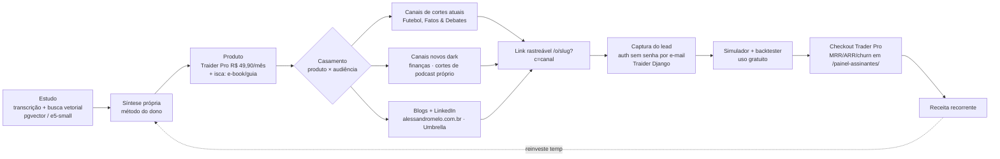

# Plano — produto próprio, canais e captura de lead

**Status:** rascunho — aguardando execução. Escrito em 05/10/2026.

## Resumo

O eixo de receita deixa de ser afiliação sobre tráfego frio de cortes e passa a ser **produto próprio
recorrente + lista de e-mail**. O modelo tem cinco elos: estudo → produto próprio → canal com a
audiência certa → captura do lead → receita recorrente. Ele substitui o plano anterior (bot de ranking
de produto de afiliado na Hotmart) por dois motivos: o bot não tinha fonte legítima de dados e violava
os Termos Gerais da Hotmart; e a economia unitária de afiliação sobre cortes é fraca — funil realista de
100k views → ~300 cliques → ~3 vendas → ~R$ 225/mês (estimativa). Um assinante do Traider Pro a
R$ 49,90/mês vale R$ 598/ano, recorrente. A operação é de uma pessoa, então **tempo é o recurso
escasso**: a ordem de execução começa por colocar tráfego no que já está construído, não por construir.

## Fluxo completo

## Produto × canal × isca × receita

**Regra de casamento:** o produto vai para o canal cuja **audiência tem o problema que ele resolve** —
nunca para o canal de maior alcance. Alcance sem o problema não converte e queima o canal.

| Produto | Canal / superfície | Audiência | Isca de topo | Receita |
|---|---|---|---|---|
| **Traider Pro** R$ 49,90/mês | canal dark de finanças (novo); blogs; LinkedIn | quem opera ou quer aprender a operar na B3 | guia "simule antes de arriscar" + acesso ao simulador sem instalar nada | assinatura recorrente |
| **Traider Pro** | Fatos & Debates (política/MBL) | parcialmente sobreposta (público de economia/mercado) | mesmo guia, CTA na descrição e comentário fixado | assinatura, conversão menor — tratar como teste |
| Curso de canal dark (afiliado Peter Jordan) | blogs, LinkedIn, canal de cortes de podcast | criador de conteúdo e dev | post/aula curta sobre operar canal sozinho | comissão de afiliado |
| Ferramenta dev de transcrição + busca | blogs, LinkedIn, GitHub | dev e estudante autodidata | artigo técnico do método de estudo | futuro: assinatura ou licença |
| **Nenhum produto** | Futebol em Cortes | torcedor | nenhuma oferta de produto | só topo de funil / marca |

Consequências diretas da regra:

- Curso de canal dark **nunca** entra no canal de futebol. Audiência errada.
- Canais de cortes atuais passam a ser **topo de funil para a lista**, não loja. Eles não são
  monetizados e já têm 1 advertência de copyright; a função deles é alcance e entrada na lista.
- Canal de cortes de podcast só nasce com **podcast próprio ou licenciado**. Conteúdo de terceiro
  recria o problema de copyright.

## O que já existe vs. o que falta construir

### Já existe — reaproveitar, não reconstruir

| Ativo | Onde | Estado |
|---|---|---|
| Simulador de pregão no navegador (replay + live, dinheiro fictício) | Traider, `/simulador/` | em produção, etapa 5 concluída |
| Backtester vetorizado <100ms, 5 setups sobre candles reais | Traider, `/backtester/` | pronto |
| Calculadora de lote / risco / margem B3 | Traider, `/calculadora/` | pronta |
| Ranking público, notícias RSS, relatório PDF | Traider | prontos |
| **Captura de lead**: auth sem senha por link de e-mail | Traider, `apps/users` | pronta — é a captura, não precisa de formulário novo |
| **Checkout e assinatura** Free → Trader Pro R$ 49,90/mês | Traider, `Subscription` | pronto |
| **Métrica de receita**: MRR, ARR, ARPU, churn, série mensal | Traider, `/painel-assinantes/` | pronta |
| Compliance CVM nº 598/20 como regra do projeto | Traider | regra ativa |
| Pipeline de clipes (corte, legenda, publicação, aprovação) | Canal de Cortes | em produção na A1 |
| **Link rastreável por origem** `/o/{slug}?c=canal` + `offer_clicks` + tela Performance | painel Laravel | em produção, **0 ofertas cadastradas** |
| Divulgação automática no Telegram por nicho | painel Laravel | código pronto, `AFFILIATE_TELEGRAM_CHANNELS` vazio |
| Transcrição + busca vetorial (pgvector, e5-small 384d) e extensão de Chrome | Canal de Cortes | em produção; é o método de estudo |
| Blogs alessandromelo.com.br e Umbrella Solutions | WordPress | no ar |
| Canais Futebol em Cortes e Fatos & Debates | YouTube | no ar, não monetizados |

### Falta construir

| Item | Natureza | Depende de |
|---|---|---|
| Página de captura da isca (guia) apontando para o Traider | reaproveitamento: usa auth existente | redação do guia |
| E-book/guia de topo (síntese própria do dono) | conteúdo, não código | estudo já feito |
| Canal dark de finanças/investimento | canal novo, conteúdo próprio | roteiro + compliance CVM |
| Canal de cortes de podcast | canal novo | ter podcast próprio ou licença |
| CTA e link rastreável nos cortes atuais | configuração: `/o/{slug}?c=canal` já existe | cadastrar a primeira oferta/destino |
| Bot de descoberta de nicho (YouTube Data API v3 + Google Trends) | código novo | chave de API |
| Unificação de métrica entre Traider e painel Laravel | decisão, ver seção de integração | — |

## Ordem de execução em fases

Da mais barata e informativa para a mais cara. Toda fase tem **critério de corte numérico definido
antes de começar** — se o número não vier, para e não escala. Horas são **estimativa**.

### Fase 0 — Tráfego para o que já está pronto (sem código novo)

- **Objetivo:** descobrir se existe demanda pelo simulador antes de construir qualquer coisa.
- **Entregáveis:** 1 página de entrada no Traider com o guia como isca (usa template existente);
  CTA para `/simulador/` em descrição, comentário fixado e card de **Fatos & Debates**; 3 posts nos
  blogs e 3 no LinkedIn apontando para lá; link rastreável `/o/{slug}?c=canal` cadastrado por origem
  (primeira oferta real do sistema de afiliados, que hoje tem 0).
- **Esforço:** 6–10 h (estimativa).
- **Critério de corte (30 dias):** **menos de 30 e-mails capturados** = a mensagem ou o canal está
  errado; para e revisa a oferta antes de gastar hora em canal novo. **Menos de 200 cliques** no
  `/o/{slug}` = o problema é alcance, não conversão — vai para a fase 1.

### Fase 1 — Guia próprio e página de conversão

- **Objetivo:** transformar visita em lead com algo que valha o e-mail.
- **Entregáveis:** guia em PDF/markdown escrito a partir da síntese do dono (busca vetorial sobre as
  transcrições como insumo de pesquisa, não como produto); página de obrigado com convite ao
  simulador; sequência de 3 e-mails (manual, sem ferramenta nova).
- **Esforço:** 12–16 h (estimativa).
- **Critério de corte (30 dias após publicar):** **taxa de captura abaixo de 5%** dos visitantes da
  página = reescreve a isca uma vez; abaixo de 5% na segunda tentativa = isca descartada.

### Fase 2 — Primeiro assinante pago

- **Objetivo:** provar que o funil fecha em dinheiro, não só em lead.
- **Entregáveis:** fluxo de e-mail do lead ao checkout; limite claro entre Free e Pro na tela;
  acompanhamento em `/painel-assinantes/`.
- **Esforço:** 8–12 h (estimativa).
- **Critério de corte (60 dias):** **0 assinante pago** com 100+ leads na lista = o produto não resolve
  o problema da lista; antes de mexer em canal, entrevista 5 leads.

### Fase 3 — Canal dark de finanças

- **Objetivo:** fonte de tráfego própria, sem copyright de terceiro, com audiência casada ao Traider.
- **Entregáveis:** 12 vídeos de conteúdo próprio, roteiro revisado contra CVM nº 598/20, disclaimer
  no vídeo e na página, CTA para a isca.
- **Esforço:** 30–40 h (estimativa) para os 12 primeiros vídeos.
- **Critério de corte (90 dias / 12 vídeos):** **menos de 10 mil views somadas** ou **menos de 50 leads
  atribuídos ao canal** = canal não paga o tempo; mantém no ar sem produzir mais e volta o esforço para
  blog e LinkedIn. RPM real medido no Analytics próprio substitui qualquer número de blog de marketing.

### Fase 4 — Bot de descoberta de nicho

- **Objetivo:** escolher nicho de canal com dado em vez de palpite.
- **Entregáveis:** script que consulta YouTube Data API v3 (`search.list` + `videos.list`: velocidade de
  views, canais novos crescendo, saturação) e Google Trends com tipo de busca "YouTube Search";
  saída em tabela ranqueada. Fonte legítima e dentro dos termos — ao contrário do bot de ranking da
  Hotmart, descartado.
- **Esforço:** 16–24 h (estimativa).
- **Critério de corte:** só começa **depois** de a fase 3 passar no critério. Se o bot não mudar nenhuma
  decisão de nicho nas 2 primeiras rodadas, congela.

### Fase 5 — Canal de cortes de podcast

- **Objetivo:** reaproveitar o pipeline de clipes já em produção com conteúdo que não gera copyright.
- **Entregáveis:** podcast próprio (ou licença escrita de um existente) como fonte; nicho apontado
  pela fase 4; cortes pelo pipeline atual.
- **Esforço:** 20 h de setup + produção contínua do podcast (estimativa).
- **Critério de corte:** **sem podcast próprio ou licença por escrito, a fase não começa.** Sem isso
  volta o risco de copyright que já custou 1 advertência.

## Integração entre os três sistemas

Três bases hoje: Traider (Django + PostgreSQL), painel do Canal de Cortes (Laravel + Inertia +
PostgreSQL na A1) e os blogs (WordPress).

**Recomendação: manter separados, com um único ponto de verdade por responsabilidade.**

| Responsabilidade | Onde mora | Por quê |
|---|---|---|
| **Lead e assinatura** | Traider (`apps/users`, `Subscription`) | a auth sem senha já é a captura e o checkout já está lá; duplicar lead em dois bancos cria divergência sem trazer nada |
| **Receita** (MRR, ARR, churn) | Traider, `/painel-assinantes/` | já construído e correto |
| **Origem do tráfego** (clique por canal) | painel Laravel, `/o/{slug}?c=canal` + `offer_clicks` | já em produção e é o único lugar que sabe de qual canal veio |
| **Conteúdo e SEO** | blogs WordPress | nada a integrar |

A costura mínima: o `/o/{slug}?c=canal` redireciona para a página de captura do Traider **com o `c`
preservado na query**, e o Traider grava a origem no cadastro do lead. Com isso o clique fica no
Laravel, o lead e a receita ficam no Traider, e a pergunta "qual canal gera assinante" é respondida
por uma coluna de origem — sem banco unificado, sem SSO, sem migração.

Unificar banco ou painel **não** se paga agora: custa dias de trabalho e o volume ainda é zero. Revisitar
só se a lista passar de alguns milhares de leads ou se aparecer um segundo produto pago.

## Riscos e mitigação

| Risco | Mitigação concreta |
|---|---|
| **Política de conteúdo inautêntico do YouTube** (endurecida 2025–2026): dark produzido em massa com IA e sem transformação é alvo. Dark resolve copyright, não resolve inautêntico. | Volume não é estratégia: 12 vídeos na fase 3, cada um com roteiro e síntese próprios, voz e edição com transformação real. Nenhum vídeo publicado só porque o pipeline conseguiu gerar. |
| **CVM nº 598/20** no canal de finanças | Roteiro e página não prometem retorno nem dão recomendação; disclaimer no vídeo e na página, como o Traider já faz nos relatórios e no simulador. Revisão de roteiro antes de gravar, não depois. |
| **Números de RPM/CPM de canal dark vêm de blog de marketing**, não de fonte primária | Tratar como ordem de grandeza. O número que vale é o do YouTube Analytics do canal próprio em 30 dias; o critério de corte da fase 3 é em views e leads, não em RPM projetado. |
| **Economia unitária fraca da afiliação sobre cortes** (100k views → ~300 cliques → ~3 vendas → ~R$ 225/mês, estimativa) | Afiliação deixa de ser o eixo e fica como receita secundária em canal casado (curso de canal dark nos blogs/LinkedIn). O eixo é assinatura recorrente. |
| **Operação de uma pessoa**: fase nova canibaliza o tempo da anterior | Uma fase ativa por vez. Fase seguinte só abre com o critério de corte da anterior avaliado por escrito neste arquivo. |
| **Advertência de copyright existente** nos canais atuais | Canais atuais não recebem conteúdo novo de risco; são topo de funil. Canal de podcast só com fonte própria ou licenciada. |

## Ideias de produto, por esforço crescente

| Ideia | Esforço | Papel | Observação |
|---|---|---|---|
| **E-book/guia** de síntese própria | baixo | isca de topo, captura e-mail | não é produto pago; serve ao Traider Pro |
| **Template do painel** (Laravel + Inertia + React 19 + shadcn, já padronizado na skill `painel-kit`) | médio | produto digital avulso para dev | reaproveita o que já existe; audiência de blog/LinkedIn |
| **Ferramenta dev de transcrição + busca vetorial** | médio–alto | produto para dev/estudante | já funciona para uso próprio; virar produto exige onboarding e multi-usuário |
| **Micro-SaaS de descoberta de nicho** (saída da fase 4 virando serviço) | alto | assinatura para criador | só depois de o bot provar utilidade no uso próprio |

Ordem recomendada: guia (agora) → template do painel (se a lista de dev responder) → ferramenta de
transcrição → micro-SaaS. Nenhum desses substitui o Traider Pro como produto principal.

## Decisões em aberto para o dono

1. A isca da fase 0 vai no **Fatos & Debates** também, ou só nos blogs e LinkedIn? (O canal de futebol
   está fora por regra de casamento.)
2. O guia da fase 1 é sobre **simulação/gestão de risco** (casa com o Traider Pro) ou sobre **operar um
   canal sozinho** (casa com o curso de afiliado)? Escolher um — dois guias dobram o trabalho e dividem
   a lista.
3. Qual é o limite entre Free e Trader Pro no simulador? Hoje o simulador é aberto; sem muro não há
   motivo para assinar.
4. O canal dark de finanças sai com voz própria ou sintetizada? Afeta diretamente o risco de conteúdo
   inautêntico.
5. Existe podcast próprio viável, ou a fase 5 fica congelada por tempo indeterminado?
6. Confirma gravar a **origem do lead** no Traider (coluna nova em `Subscription`/usuário) para fechar o
   rastreio `/o/{slug}?c=canal` → assinante?
7. Qual meta mínima de MRR em 6 meses torna esse plano "funcionou"? Sem esse número os critérios de
   corte por fase não têm teto de referência.
