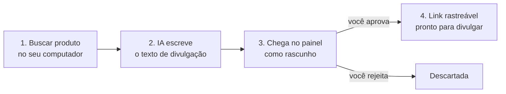
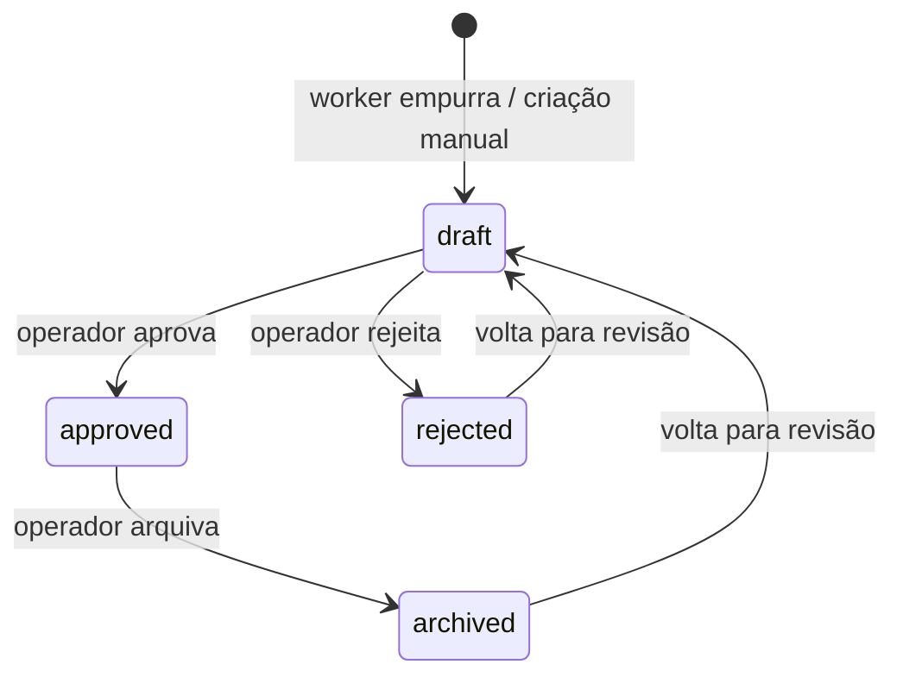
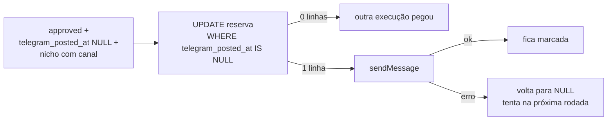

# Sistema de afiliados

Como o Canal de Cortes busca, prepara, aprova e divulga ofertas de afiliado. Decisões de arquitetura
e motivos estão em [`PLANO-MESTRE.md`](PLANO-MESTRE.md#6-afiliados); este documento descreve o que
foi construído.

Última atualização: **15/09/2026** — fase 2 (branch `afiliadas-fase2`): divulgação no Telegram, tela de
performance e tema Umbrella Solutions.

**Na master e em produção desde 18/09/2026.** Sem dado de exemplo: as telas leem a tabela `offers`
de verdade, então Ofertas e Performance abrem **vazias** até entrar a primeira oferta (pelo worker, com
`AFFILIATE_API_TOKEN` configurado no servidor, ou em **Nova oferta** no painel). Sem esse token a API
responde `503 affiliate_api_not_configured`; sem `AFFILIATE_TELEGRAM_CHANNELS` a divulgação no
Telegram não posta nada — as duas falham fechado.

---

## Para o operador — como funciona, sem termos técnicos

Uma oferta passa por quatro etapas. Só a última gera dinheiro, e só você decide quando ela acontece.



| Etapa | Onde acontece | Quem faz |
|---|---|---|
| Buscar produto | Seu computador (`affiliate-worker`) | Você roda um comando, ou importa uma planilha com os links que pegou na Hotmart |
| Escrever texto | Seu computador | IA (Claude; se falhar, Groq; se falhar, um modelo pronto) |
| Revisar | Painel → **Ofertas** → aba Rascunhos | Você lê, edita se quiser, aprova ou rejeita |
| Divulgar no Telegram | Canal do Telegram do nicho | **Automático**: a cada 30 min, das 8h às 22h, o painel posta até 3 ofertas aprovadas que ainda não foram ao ar |
| Divulgar no resto | Comentário fixado, descrição, blog | Você copia o link rastreável da oferta aprovada |
| Ver resultado | Painel → **Ofertas** → botão **Performance** | Você acompanha cliques por oferta, por canal e por dia |

**Por que o link é "rastreável":** em vez de divulgar o link da Hotmart direto, você divulga um
link curto do painel (`/o/abc123`). Quando alguém clica, o painel conta o clique, anota de onde veio
(Telegram, YouTube, blog) e manda a pessoa para o link da Hotmart. Assim você sabe qual canal vende.

**Cada oferta vai ao Telegram uma vez só.** Depois de postada ela ganha o selo "Telegram" na lista. Se
o Telegram recusar o envio (canal errado, bot sem permissão), a oferta fica na fila e o painel tenta de
novo na rodada seguinte.

**Onde fica no painel:** clique no nome no topo da barra lateral (**Canal de Cortes · Pipeline de
clipes**) e troque para **Afiliados · Pipeline de afiliados**. A barra passa a mostrar só o que é de
afiliados (Ofertas e Performance). Para voltar aos clipes, mesmo caminho.

**Criar oferta à mão com texto pronto:** em Ofertas → **Nova oferta**, preencha o link de afiliado (e,
se tiver, a página do produto) e clique em **Gerar com IA**. O painel lê a página do produto e escreve a
chamada (CTA), o texto curto e o texto longo com técnicas de venda, sem inventar preço nem desconto.
Revise e salve. Se já havia texto escrito, o aviso traz **Desfazer**. O **i** ao lado de "Chamada (CTA)"
explica o que é uma CTA. O mesmo botão aparece na edição de uma oferta.

| Botão | O que usa | Se falhar |
|---|---|---|
| Gerar com IA | Página do produto (ou o link de afiliado) + título + nicho | Claude → Groq. Se as duas falharem, aparece o erro e você escreve à mão |

**O que o sistema nunca faz sozinho:** publicar oferta sem aprovação, inventar link de afiliado,
inventar preço ou desconto.

---

## Componentes

| Parte | Onde | Papel |
|---|---|---|
| Worker local | `affiliate-worker/` | Busca candidatos, importa ofertas do operador, gera copy com IA, **empurra** para o servidor |
| API de ofertas | `painel/routes/api.php` | Recebe ofertas do worker. Autenticação por token |
| Tela Ofertas | `/painel/ofertas` | Revisão, edição, aprovação, cópia do link rastreável |
| Gerar copy no painel | `POST /painel/ofertas/gerar-copy` → `App\Services\OfferCopywriter` | Lê a página (bloqueia IP interno em cada redirect), gera CTA/curto/longo. Anthropic → Groq. Não grava; limite 20/min |
| Área na sidebar | `components/workspace-switcher.tsx` + `app-sidebar.tsx` | Troca entre "Pipeline de clipes" e "Pipeline de afiliados"; `/painel/ofertas*` abre em afiliados |
| Redirect rastreável | `/o/{slug}` | Conta o clique e redireciona para o link da rede |
| Divulgação Telegram | `php artisan offers:publish-telegram` (agendado) | Posta oferta aprovada no canal do nicho e marca `telegram_posted_at` |
| Tela Performance | `/painel/ofertas/performance` | Cliques por oferta, canal e dia a partir de `offer_clicks` |

O servidor **nunca chama** o worker. Máquina local desligada não afeta nada em produção.

---

## Banco

Mesmo banco do pipeline, tabelas próprias, sem FK para `generated_clips`. Schema escrito só com
Schema builder, sem `enum` nativo — roda em MySQL 8.4 e PostgreSQL 17.

### `offers`

| Coluna | Tipo | Nota |
|---|---|---|
| `network` | string(40) | hotmart, eduzz, kiwify, monetizze, amazon, mercadolivre, shopee, awin, manual |
| `external_id` | string(191) null | id do produto na rede. `unique(network, external_id)` — chave do upsert |
| `niche` | string(50) | slug de `niches` |
| `title` | string(255) | |
| `affiliate_url` | text | link com tracking da rede. Obrigatório, só http/https |
| `slug` | string(64) unique | gerado no servidor; compõe `/o/{slug}` |
| `product_url`, `image_url`, `description` | null | |
| `price_cents`, `currency`, `commission_percent` | null | preço em centavos |
| `cta_text`, `copy_short`, `copy_long` | null | textos de divulgação |
| `ai_provider` | string(30) null | anthropic, groq, claude-local, manual |
| `status` | string(20) | `draft` → `approved` / `rejected` / `archived` |
| `clicks_count` | unsigned int | incremento atômico no redirect |
| `approved_at` | timestamp null | setado ao aprovar, zerado ao sair de approved |
| `telegram_posted_at` | timestamp null | quando foi postada no Telegram. Não é zerada ao mudar de status — oferta reaprovada não é repostada. Índice `(status, telegram_posted_at)` |

### `offer_clicks`

| Coluna | Nota |
|---|---|
| `offer_id` | FK com `cascadeOnDelete` (tabela nova, não herda a regra antiga das FKs sem cascade) |
| `channel` | vem de `?c=` — telegram, youtube, blog, bio, instagram, tiktok, outro; valor inválido vira null |
| `ip_hash` | sha256(ip + `APP_KEY`). **IP cru nunca é gravado** (LGPD) |
| `user_agent`, `referer` | truncados |

### Estados



Só `approved` responde em `/o/{slug}`. Qualquer outro status devolve 404.

---

## API

### Autenticação

`Authorization: Bearer <AFFILIATE_API_TOKEN>`, comparado com `hash_equals`.

| Situação | Resposta |
|---|---|
| Servidor sem `AFFILIATE_API_TOKEN` | **503** `affiliate_api_not_configured` — fail-closed |
| Token ausente ou errado | 401 |
| Mais de 60 req/min | 429 |

### `POST /api/offers`

Corpo `{"offers": [...]}`, de 1 a 100 itens. `status` enviado pelo cliente é ignorado.

Regra de upsert por `(network, external_id)`:

| Situação | Resultado |
|---|---|
| Não existe | cria como `draft` → `created` |
| Existe em `draft` | atualiza conteúdo → `updated` |
| Existe em outro status | **não toca** → `skipped` |

A terceira linha é proposital: rodar o worker de novo não pode desfazer uma aprovação ou rejeição.

### `GET /api/offers?status=approved&niche=futebol`

Lista paginada (máx. 100 por página), default `approved`. Base para automações de divulgação.

### `GET /o/{slug}?c=telegram`

Público, 120 req/min. Oferta aprovada → grava clique → 302 para `affiliate_url`. A URL de destino é
validada como http/https também no momento do redirect, não só na criação — evita open redirect.

---

## Worker local

Detalhes de instalação e formato do CSV em [`affiliate-worker/README.md`](../../affiliate-worker/README.md).

| Comando | Faz |
|---|---|
| `search --source mercadolivre --query ... --niche ...` | grava candidatos em `data/candidates.json`, **sem** link de afiliado |
| `import --file ofertas.csv` | carrega ofertas com link colado pelo operador |
| `copy` | gera `cta_text`, `copy_short`, `copy_long` |
| `push [--dry-run]` | envia em lotes de 100 |
| `run --file ...` | import + copy + push |

**IA:** Anthropic `claude-haiku-4-5` → Groq → template determinístico. Segue a regra do projeto de
todo caminho novo de IA nascer com fallback Groq ([`SISTEMA-IA-SELECAO.md`](SISTEMA-IA-SELECAO.md)).
O template garante que a etapa de copy nunca trava o fluxo. Copy gerada pelo template chega com `ai_provider = manual`; campos já preenchidos pelo operador
nunca são sobrescritos.

**Retry:** 429, 5xx e timeout com backoff. 401 e 422 não repetem — são erro de configuração ou dado.

**Limites conhecidos:**
- Hotmart, Eduzz e Kiwify não oferecem API de catálogo para afiliado. O caminho é importar planilha.
- A busca pública do Mercado Livre pode exigir token; sem ele o comando avisa e não quebra. O
  `MERCADOLIVRE_ACCESS_TOKEN` expira em ~6 h e o worker não renova. Não foi testado contra a API real.
- As regras "não prometer resultado / não inventar preço" estão no prompt, não no código. A revisão no
  painel é a barreira final.
- A Product Advertising API da Amazon só libera após 3 vendas em 180 dias.
- Nenhuma loja é raspada por HTML.

---

## Divulgação no Telegram

Comando `offers:publish-telegram`, agendado em `routes/console.php`: a cada 30 min, 08h–22h
(America/Sao_Paulo), `withoutOverlapping`. Usa o bot já configurado (`telegram.bots.mybot`).



| Regra | Detalhe |
|---|---|
| Mensagem | `copy_short` (ou `cta_text`, ou `title`) + linha em branco + `/o/{slug}?c=telegram`. Texto puro, sem `parse_mode` |
| Canal por nicho | `AFFILIATE_TELEGRAM_CHANNELS="futebol=@canal,politica=-100123"`. Nicho fora do mapa não é postado nem trava a fila dos outros |
| Ordem e volume | mais antigas por `approved_at` primeiro; `AFFILIATE_TELEGRAM_PER_RUN` por rodada (padrão 3), `--limit` sobrescreve |
| Idempotência | reserva atômica antes do envio. Queda entre reserva e envio perde aquele post (at-most-once) — preferível a repetir oferta no canal |
| Fail-closed | sem `TELEGRAM_BOT_TOKEN` ou sem mapa de canais: não envia nada e sai com código 1 |
| Teste manual | `php artisan offers:publish-telegram --dry-run` mostra o que seria enviado sem enviar nem marcar |

Sem IA nesse caminho: a copy já veio pronta do worker (Anthropic → Groq → template).

---

## Tela de performance

`/painel/ofertas/performance?days=7|30|90` (padrão 30; valor inválido volta para 30).

| Bloco | Fonte |
|---|---|
| Cards | cliques, visitantes únicos (`COUNT(DISTINCT ip_hash)`), ofertas com clique, canal líder |
| Cliques por dia | `DATE(created_at)` agrupado; dias sem clique entram zerados. O dia é contado no **horário de Brasília** (`affiliates.report_timezone`): o banco grava em UTC e a consulta desloca o horário antes de separar os dias (`CONVERT_TZ` no MySQL, `INTERVAL` no PostgreSQL) |
| Por canal | `channel` agrupado. `NULL` aparece como "Sem canal" (link sem `?c=` ou valor inválido) |
| Por oferta | top 100 por cliques, com quebra por canal e último clique |

**Privacidade:** `ip_hash` só é usado dentro de `COUNT(DISTINCT)` no banco. Nenhum hash sai nas props — há
teste que garante isso. Agregação toda em SQL portável (MySQL 8.4 / PostgreSQL 17).

---

## Marca Umbrella Solutions

Mesmo Laravel, mesmo banco, mesmas rotas. Só muda apresentação ([`PLANO-MESTRE.md`](PLANO-MESTRE.md#5-marca--umbrella-solutions)).

| Peça | Onde |
|---|---|
| Marcas (nome, tagline, ícone, logo) | `painel/config/branding.php` |
| Seleção | `App\Support\Brand::resolve()`: host em `BRAND_DOMAINS` → senão `APP_BRAND` → senão `canaldecortes` |
| Entrega ao front | prop Inertia `brand` + `<html data-brand="...">` + `<title>` |
| Cores, raio, gráficos, sidebar | `resources/css/app.css`, blocos `:root[data-brand='umbrella']` e `.dark[data-brand='umbrella']` |
| Tipografia | `--brand-font-sans` / `--brand-font-heading`. Umbrella usa Manrope nos títulos (Google Fonts, carregada só nessa marca) |
| Logo | componente `BrandMark`: usa `BRAND_UMBRELLA_LOGO` se definido, senão ícone sobre gradiente `--brand-logo-from/to` |

Para adicionar uma marca: nova entrada em `branding.brands` + blocos `[data-brand='<chave>']` no CSS.

---

## Configuração

| Variável | Onde | Uso |
|---|---|---|
| `AFFILIATE_API_TOKEN` | `painel/.env` **e** `affiliate-worker/.env` | mesmo valor nos dois. Gerar com `openssl rand -hex 32` |
| `AFFILIATE_API_URL` | `affiliate-worker/.env` | ex. `https://toolscut.alessandromelo.com.br` |
| `ANTHROPIC_API_KEY`, `GROQ_API_KEY`, `GROQ_MODEL` | `affiliate-worker/.env` **e** `painel/.env` | copy com IA (worker e botão "Gerar com IA"). Sem as duas chaves no painel o botão responde erro |
| `MERCADOLIVRE_ACCESS_TOKEN` | `affiliate-worker/.env` | opcional |
| `AFFILIATE_TELEGRAM_CHANNELS` | `painel/.env` | `nicho=chat` separado por vírgula. Vazio = nada é postado |
| `AFFILIATE_TELEGRAM_PER_RUN` | `painel/.env` | ofertas por rodada, padrão 3 |
| `TELEGRAM_BOT_TOKEN` | `painel/.env` | já existia. O bot precisa ser **administrador** de cada canal de destino |
| `APP_BRAND` | `painel/.env` | `canaldecortes` (padrão) ou `umbrella` |
| `BRAND_DOMAINS` | `painel/.env` | `host=marca`, vence `APP_BRAND`. Ex. `painel.umbrellasolutions.com.br=umbrella` |
| `BRAND_UMBRELLA_LOGO`, `BRAND_CANALDECORTES_LOGO` | `painel/.env` | caminho público do logo; vazio = ícone do tema |

Sem `AFFILIATE_API_TOKEN` no painel a API fica desligada (503). Esse é o estado seguro padrão.

---

## Deploy

1. `php artisan migrate` — cria `offers` e `offer_clicks` e adiciona `offers.telegram_posted_at`
   (nullable). Não altera tabela do pipeline.
2. `.env` do servidor: `AFFILIATE_API_TOKEN`; para divulgar, `AFFILIATE_TELEGRAM_CHANNELS`.
3. Criar os canais no Telegram e adicionar o bot como administrador. Validar com `--dry-run`.
4. `./deploy.sh` (compila o Vite localmente, sincroniza e limpa cache).

O agendamento depende do `schedule:run` que já roda no crontab do container `php`. Não precisa de
rebuild do `clip-processor`: nada do pipeline de vídeo foi alterado.

**Testes:** 81 Pest e 47 pytest (`affiliate-worker`). A suíte do painel passa igual nos dois bancos:
**MySQL 8.4** e **PostgreSQL 17** (81 testes, 391 asserções em cada).

Para rodar contra PostgreSQL, em banco separado do usado pela migração:

```bash
docker exec postgres psql -U kelnab -d kelnab -c "CREATE DATABASE clips_afiliados_teste;"
docker run --rm --network wordpress_internal -v "$PWD":/app -w /app \
  -e DB_CONNECTION=pgsql -e DB_HOST=postgres -e DB_DATABASE=clips_afiliados_teste \
  -e DB_USERNAME=kelnab -e DB_PASSWORD=secret -e DB_URL= \
  canaldecortes-php:pg sh -c 'php artisan migrate --force && php vendor/bin/pest'
```

Use a imagem `canaldecortes-php:pg`: a `wordpress-php` não traz `pdo_pgsql`.

---

## Próximos passos

- Domínio Umbrella: DNS, vhost nginx e certificado apontando para o mesmo painel, e `BRAND_DOMAINS` no
  `.env`. O código já escolhe o tema pelo host.- Logo real da Umbrella (SVG em `public/`, via `BRAND_UMBRELLA_LOGO`). Hoje é ícone sobre gradiente.
- Algumas cores de destaque ainda são fixas no código (ex. `#FF6A55` nos cards do Dashboard) e não
  mudam com a marca.
- Telegram com imagem (`sendPhoto` com `image_url`). Hoje é só texto.
- Página de links própria no domínio (substitui Linktree, rastreável).
