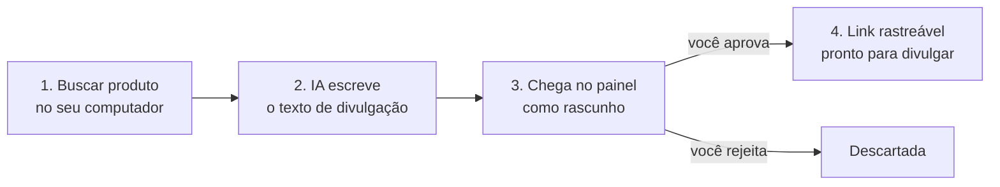
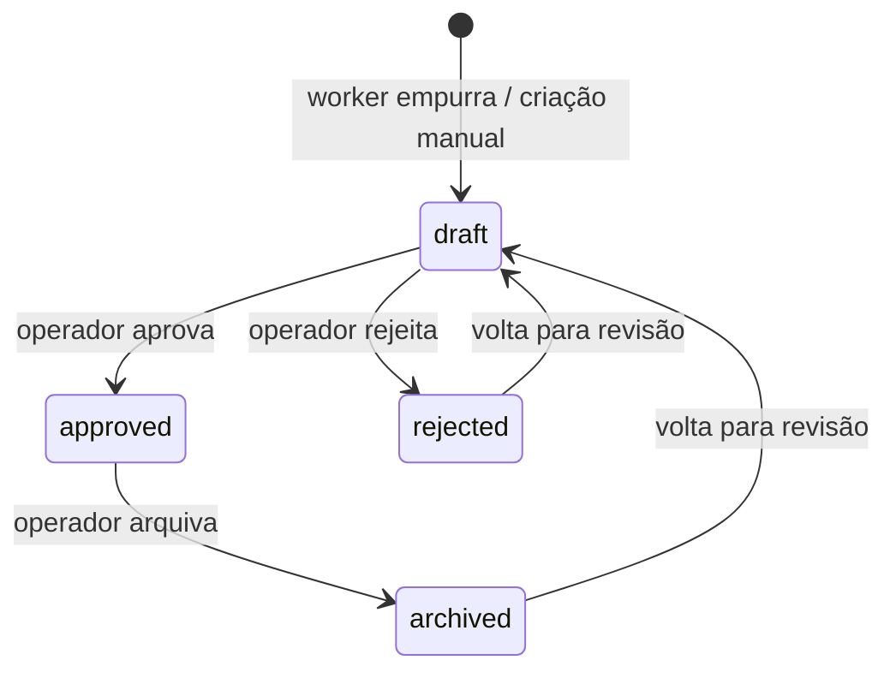

# Sistema de afiliados

Como o Canal de Cortes busca, prepara, aprova e divulga ofertas de afiliado. Decisões de arquitetura
e motivos estão em [`PLANO-MESTRE.md`](PLANO-MESTRE.md#6-afiliados); este documento descreve o que
foi construído.

Última atualização: **15/09/2026** (primeira versão, branch `afiliadas`).

---

## Para o operador — como funciona, sem termos técnicos

Uma oferta passa por quatro etapas. Só a última gera dinheiro, e só você decide quando ela acontece.

| Etapa | Onde acontece | Quem faz |
|---|---|---|
| Buscar produto | Seu computador (`affiliate-worker`) | Você roda um comando, ou importa uma planilha com os links que pegou na Hotmart |
| Escrever texto | Seu computador | IA (Claude; se falhar, Groq; se falhar, um modelo pronto) |
| Revisar | Painel → **Ofertas** → aba Rascunhos | Você lê, edita se quiser, aprova ou rejeita |
| Divulgar | Telegram, comentário fixado, descrição, blog | Você copia o link rastreável da oferta aprovada |

**Por que o link é "rastreável":** em vez de divulgar o link da Hotmart direto, você divulga um
link curto do painel (`/o/abc123`). Quando alguém clica, o painel conta o clique, anota de onde veio
(Telegram, YouTube, blog) e manda a pessoa para o link da Hotmart. Assim você sabe qual canal vende.

**O que o sistema nunca faz sozinho:** publicar oferta sem aprovação, inventar link de afiliado,
inventar preço ou desconto.

---

## Componentes

| Parte | Onde | Papel |
|---|---|---|
| Worker local | `affiliate-worker/` | Busca candidatos, importa ofertas do operador, gera copy com IA, **empurra** para o servidor |
| API de ofertas | `painel/routes/api.php` | Recebe ofertas do worker. Autenticação por token |
| Tela Ofertas | `/painel/ofertas` | Revisão, edição, aprovação, cópia do link rastreável |
| Redirect rastreável | `/o/{slug}` | Conta o clique e redireciona para o link da rede |

O servidor **nunca chama** o worker. Máquina local desligada não afeta nada em produção.

---

## Banco

Mesmo banco do pipeline, tabelas próprias, sem FK para `generated_clips`. Schema escrito só com
Schema builder, sem `enum` nativo — roda em MySQL 8.4 e PostgreSQL 17.

### `offers`

| Coluna | Tipo | Nota |
|---|---|---|
| `network` | string(40) | hotmart, eduzz, kiwify, monetizze, amazon, mercadolivre, shopee, awin, manual |
| `external_id` | string(191) null | id do produto na rede. `unique(network, external_id)` — chave do upsert |
| `niche` | string(50) | slug de `niches` |
| `title` | string(255) | |
| `affiliate_url` | text | link com tracking da rede. Obrigatório, só http/https |
| `slug` | string(64) unique | gerado no servidor; compõe `/o/{slug}` |
| `product_url`, `image_url`, `description` | null | |
| `price_cents`, `currency`, `commission_percent` | null | preço em centavos |
| `cta_text`, `copy_short`, `copy_long` | null | textos de divulgação |
| `ai_provider` | string(30) null | anthropic, groq, claude-local, manual |
| `status` | string(20) | `draft` → `approved` / `rejected` / `archived` |
| `clicks_count` | unsigned int | incremento atômico no redirect |
| `approved_at` | timestamp null | setado ao aprovar, zerado ao sair de approved |

### `offer_clicks`

| Coluna | Nota |
|---|---|
| `offer_id` | FK com `cascadeOnDelete` (tabela nova, não herda a regra antiga das FKs sem cascade) |
| `channel` | vem de `?c=` — telegram, youtube, blog, bio, instagram, tiktok, outro; valor inválido vira null |
| `ip_hash` | sha256(ip + `APP_KEY`). **IP cru nunca é gravado** (LGPD) |
| `user_agent`, `referer` | truncados |

### Estados

Só `approved` responde em `/o/{slug}`. Qualquer outro status devolve 404.

---

## API

### Autenticação

`Authorization: Bearer <AFFILIATE_API_TOKEN>`, comparado com `hash_equals`.

| Situação | Resposta |
|---|---|
| Servidor sem `AFFILIATE_API_TOKEN` | **503** `affiliate_api_not_configured` — fail-closed |
| Token ausente ou errado | 401 |
| Mais de 60 req/min | 429 |

### `POST /api/offers`

Corpo `{"offers": [...]}`, de 1 a 100 itens. `status` enviado pelo cliente é ignorado.

Regra de upsert por `(network, external_id)`:

| Situação | Resultado |
|---|---|
| Não existe | cria como `draft` → `created` |
| Existe em `draft` | atualiza conteúdo → `updated` |
| Existe em outro status | **não toca** → `skipped` |

A terceira linha é proposital: rodar o worker de novo não pode desfazer uma aprovação ou rejeição.

### `GET /api/offers?status=approved&niche=futebol`

Lista paginada (máx. 100 por página), default `approved`. Base para automações de divulgação.

### `GET /o/{slug}?c=telegram`

Público, 120 req/min. Oferta aprovada → grava clique → 302 para `affiliate_url`. A URL de destino é
validada como http/https também no momento do redirect, não só na criação — evita open redirect.

---

## Worker local

Detalhes de instalação e formato do CSV em [`affiliate-worker/README.md`](../../affiliate-worker/README.md).

| Comando | Faz |
|---|---|
| `search --source mercadolivre --query ... --niche ...` | grava candidatos em `data/candidates.json`, **sem** link de afiliado |
| `import --file ofertas.csv` | carrega ofertas com link colado pelo operador |
| `copy` | gera `cta_text`, `copy_short`, `copy_long` |
| `push [--dry-run]` | envia em lotes de 100 |
| `run --file ...` | import + copy + push |

**IA:** Anthropic `claude-haiku-4-5` → Groq → template determinístico. Segue a regra do projeto de
todo caminho novo de IA nascer com fallback Groq ([`SISTEMA-IA-SELECAO.md`](SISTEMA-IA-SELECAO.md)).
O template garante que a etapa de copy nunca trava o fluxo.

**Retry:** 429, 5xx e timeout com backoff. 401 e 422 não repetem — são erro de configuração ou dado.

**Limites conhecidos:**
- Hotmart, Eduzz e Kiwify não oferecem API de catálogo para afiliado. O caminho é importar planilha.
- A busca pública do Mercado Livre pode exigir token; sem ele o comando avisa e não quebra.
- A Product Advertising API da Amazon só libera após 3 vendas em 180 dias.
- Nenhuma loja é raspada por HTML.

---

## Configuração

| Variável | Onde | Uso |
|---|---|---|
| `AFFILIATE_API_TOKEN` | `painel/.env` **e** `affiliate-worker/.env` | mesmo valor nos dois. Gerar com `openssl rand -hex 32` |
| `AFFILIATE_API_URL` | `affiliate-worker/.env` | ex. `https://toolscut.alessandromelo.com.br` |
| `ANTHROPIC_API_KEY`, `GROQ_API_KEY`, `GROQ_MODEL` | `affiliate-worker/.env` | copy com IA |
| `MERCADOLIVRE_ACCESS_TOKEN` | `affiliate-worker/.env` | opcional |

Sem `AFFILIATE_API_TOKEN` no painel a API fica desligada (503). Esse é o estado seguro padrão.

---

## Deploy

1. `php artisan migrate` — só cria `offers` e `offer_clicks`, não altera tabela existente.
2. Adicionar `AFFILIATE_API_TOKEN` ao `.env` do servidor.
3. `./deploy.sh` (compila o Vite localmente, sincroniza e limpa cache).

Não precisa de rebuild do `clip-processor` — nada do pipeline de vídeo foi alterado.

---

## Próximos passos

- Publicação automática de oferta aprovada em canal do Telegram (usa `GET /api/offers`).
- Tela de performance: cliques por oferta, por canal e por dia a partir de `offer_clicks`.
- Tema e domínio Umbrella Solutions ([`PLANO-MESTRE.md`](PLANO-MESTRE.md#5-marca--umbrella-solutions)).
