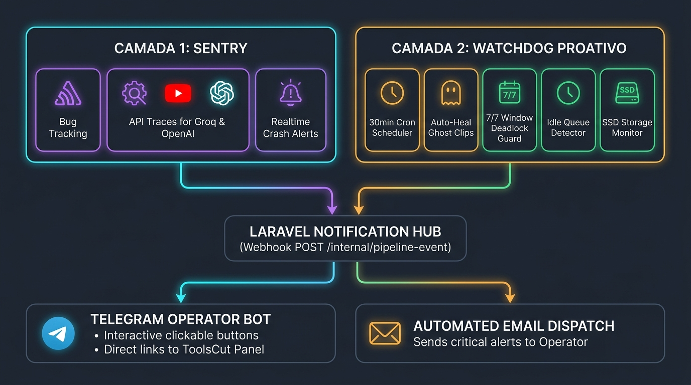

# Sistema de Alertas, Monitoramento e Watchdog

Este documento descreve a arquitetura de observabilidade, tratamento de erros, detecção de deadlocks e sistema de notificações ativas do Canal de Cortes.

Última atualização: **Setembro/2026**

---

## 1. Visão Geral



O sistema adota uma abordagem de **defesa em duas camadas** para garantir que nenhuma falha interrompa silenciosamente a operação diária dos canais no YouTube:

```
┌────────────────────────────────────────────────────────────────────────┐
│                          CAMADA 1: SENTRY                              │
│  - Captura Exceções não tratadas (Python & PHP)                        │
│  - Traces de Performance e chamadas a APIs (Groq, YouTube, OpenAI)     │
│  - Alertas instantâneos de Crash em tempo real                         │
└────────────────────────────────────────────────────────────────────────┘

┌────────────────────────────────────────────────────────────────────────┐
│                     CAMADA 2: WATCHDOG PROATIVO                        │
│  - Executado a cada 30 min pelo daemon (watchdog.py)                   │
│  - Detecta Deadlocks de Negócio (janela 7/7 ocupada >2h sem progresso) │
│  - Auto-Cura de Clipes Fantasmas (remove órfãos sem .mp4 do disco)     │
│  - Monitor de Fila Vazia em horário comercial (>6h sem aprovações)     │
│  - Validador prévio de Credenciais OAuth antes das postagens           │
│  - Monitor de Armazenamento SSD (< 5 GB livres ou > 85% em uso)        │
└────────────────────────────────────────────────────────────────────────┘
                                    │
                                    ▼
┌────────────────────────────────────────────────────────────────────────┐
│                   HUB DE NOTIFICAÇÕES (LARAVEL)                        │
│         POST /internal/pipeline-event (X-Internal-Token)               │
└────────────────────────────────────────────────────────────────────────┘
                    │                               │
                    ▼                               ▼
    ┌───────────────────────────────┐   ┌───────────────────────────────┐
    │     TELEGRAM BOT DO OPERADOR  │   │       ALERTA POR E-MAIL       │
    │  Mensagens com link direto    │   │  Envio para o operador        │
    │  para https://toolscut...     │   │  (alessandrobm1988@gmail.com) │
    └───────────────────────────────┘   └───────────────────────────────┘
```

---

## 2. Camada 1: Sentry (Erros de Código e Runtime)

O Sentry atua interceptando exceções de baixo nível, erros 500 no Laravel e falhas imprevistas em chamadas de API externas no `clip-processor`.

### Configuração
- **clip-processor**: Configurado no `src/main.py` via pacote `sentry-sdk`.
- **painel (Laravel)**: Integrado via DSN no `.env`.

Variável de ambiente necessária:
```env
SENTRY_DSN=https://seu_token_publico@o000000.ingest.sentry.io/0000000
```

Quando a variável não está definida, o sistema roda normalmente sem tentar registrar eventos externos.

---

## 3. Camada 2: Watchdog Inteligente (`watchdog.py`)

Muitas interrupções em pipelines de dados ocorrem por **deadlocks lógicos silenciosos** — situações onde nenhum erro de código é lançado (e o Sentry não detecta nada), mas o robô para de baixar novos vídeos porque as regras de negócio foram satisfeitas de forma incorreta.

O `watchdog.py` roda a cada **30 minutos** e executa 5 verificações essenciais:

### 3.1. Auto-Cura de Clipes Fantasmas (`check_ghost_clips`)
- **Problema**: Clipes marcados como `approved` ou `pending_cut` que não possuem o arquivo `.mp4` correspondente no disco `/app/videos/`. Clipes nesse estado seguram permanentemente o slot de download do vídeo fonte.
- **Ação**: Marca o clipe órfão como `failed`, limpa o `clip_path`, atualiza o vídeo fonte para `published` e notifica o operador.
- **Resultado**: Vagas na janela de download são destravadas imediatamente sem intervenção humana.

### 3.2. Monitor de Deadlock da Janela de Download (`check_download_window_health`)
- **Problema**: Se as 7 vagas da janela estiverem ocupadas e nenhum vídeo fonte tiver sido atualizado nas últimas **2 horas**, a ingestão de novos conteúdos está travada.
- **Ação**: Dispara um alerta crítico imediato no Telegram e por E-mail informando que a janela está estagnada.

### 3.3. Monitor de Fila Ociosa (`check_approval_queue_activity`)
- **Problema**: Fila de aprovação com 0 cortes pendentes e 0 cortes gerados nas últimas **6 horas** durante o horário útil (08:00 às 23:00).
- **Ação**: Envia alerta preventivo para verificar se os canais fonte publicaram vídeos novos ou se houve bloqueio no YouTube RSS.

### 3.4. Validador Prévio de OAuth (`check_youtube_tokens`)
- **Problema**: Canal ativo configurado no painel sem o arquivo `token-{slug}.json` em `/app/youtube/`.
- **Ação**: Envia alerta com link direto para `/painel/canais` para reautenticação antes que ocorra a tentativa de upload na janela nobre (19h–22h).

### 3.5. Monitor de Armazenamento SSD (`check_disk_space`)
- **Problema**: Espaço livre menor que 5 GB ou uso do disco superior a 85%.
- **Ação**: Emite alerta de armazenamento para que seja executada a limpeza de arquivos de vídeo temporários.

---

## 4. Hub de Notificações e Eventos

O `clip-processor` publica eventos através do cliente HTTP `telegram_notifier.py`, fazendo um POST autenticado para o Laravel:

- **Endpoint**: `http://nginx/internal/pipeline-event`
- **Cabeçalho**: `X-Internal-Token: ${CLIP_PROCESSOR_INTERNAL_TOKEN}`
- **Payload**:
  ```json
  {
    "event": "watchdog_alert",
    "payload": {
      "type": "download_window_deadlock",
      "occupied": 7,
      "max_slots": 7,
      "message": "🚨 Alerta Crítico: A Janela de Download está travada em 7/7 vagas sem progresso há mais de 2 horas."
    }
  }
  ```

### Tipos de Eventos Suportados

| Evento | Descrição | Destinos |
|---|---|---|
| `watchdog_alert` | Auto-cura executada, deadlock de janela ou fila ociosa | Telegram + E-mail |
| `pipeline_failure` | Falha crítica em transcrição, corte ou upload | Telegram + E-mail |
| `oauth_warning` | Ausência de credencial OAuth de canal ativo | Telegram + E-mail |
| `disk_warning` | Espaço em disco perigosamente baixo | Telegram |
| `clip_ttl_warning` | Clipe pendente perto de expirar (janela de 36h) | Telegram |
| `upload_published` | Sucesso no upload com link para o YouTube | Telegram |
| `daily_summary` | Resumo diário de clipes aguardando aprovação | Telegram |

---

## 5. Formato das Mensagens com Links Diretos

Todas as mensagens enviadas para o Telegram do operador contêm links clicáveis direcionando imediatamente para a tela de resolução no painel:

- **Alerta de Deadlock / Watchdog**: Link direto para `https://toolscut.alessandromelo.com.br/painel`
- **Alerta de Token OAuth**: Link direto para `https://toolscut.alessandromelo.com.br/painel/canais`
- **Alerta de Publicação**: Link direto para assistir o vídeo no YouTube (`https://youtube.com/shorts/...` ou `/watch?v=...`)

---

## 6. Variáveis de Ambiente Relevantes

### No `clip-processor` (`.env` ou `docker-compose.yml`):
```env
SENTRY_DSN=
CLIP_PROCESSOR_INTERNAL_TOKEN=seu_token_secreto_aqui
LARAVEL_NOTIFY_URL=http://nginx/internal/pipeline-event
LARAVEL_HOST_HEADER=canaldecortes.local
```

### No `painel` (`.env`):
```env
ADMIN_ALERT_EMAIL=alessandrobm1988@gmail.com
TELEGRAM_BOT_TOKEN=...
TELEGRAM_CHAT_ID_ALLOWED=5760918317
CLIP_PROCESSOR_INTERNAL_TOKEN=seu_token_secreto_aqui
```

---

## 7. Como Testar e Simular Alertas

### Testar ciclo completo do Watchdog via CLI no container:
```bash
docker exec -it canaldecortes-clip-processor-1 python3 -c "
from src.db import get_db_connection
from src.watchdog import run_watchdog_cycle
conn = get_db_connection()
res = run_watchdog_cycle(conn)
print(res)
"
```

### Testar testes unitários do Watchdog (pytest):
```bash
cd clip-processor && pytest tests/test_watchdog.py
```
