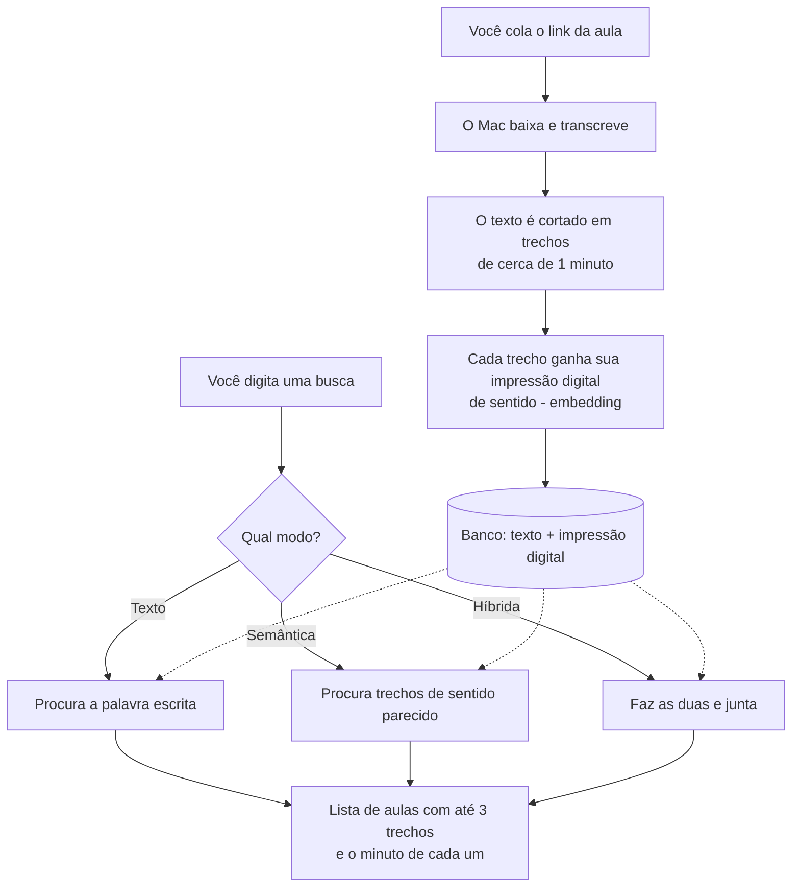
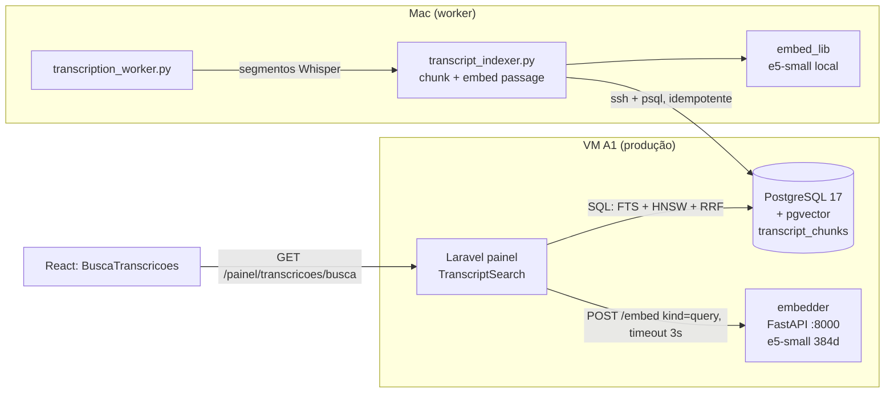

# Busca nas transcrições (texto, semântica e híbrida)

Última atualização: **29/09/2026** (desenho e contratos; a implementação segue em `feature/busca-vetorial`).
Decisão registrada em [`../adr/0001-busca-vetorial-nas-transcricoes.md`](../adr/0001-busca-vetorial-nas-transcricoes.md).

Este documento tem duas partes: a **Parte 1** é para quem usa o painel e não programa; a **Parte 2**
é técnica, para quem vai mexer, subir em produção ou reindexar.

---

# Parte 1 — Para quem usa o painel

## O que mudou na tela de Transcrições

Antes, a busca só achava as palavras exatamente como digitadas. Agora ela também entende o
**sentido** da pergunta e mostra **o trecho exato** onde o assunto aparece, com o minuto do vídeo.
Clicando no minuto, você abre a aula naquele ponto.

## Três jeitos de buscar

Ao lado do campo de busca há um seletor com três modos. O padrão é **Híbrida**, e é o que você deve
usar quase sempre.

| Modo | Como pensa | Bom para | Exemplo |
|---|---|---|---|
| **Texto** | Procura a palavra escrita. Ignora acento e maiúscula e aceita variações simples (plural, conjugação). | Nome próprio, termo técnico, número, frase que você lembra | Buscar `funil` acha "funil", "funis" |
| **Semântica** | Procura pelo **sentido**, mesmo que a palavra não apareça. | Quando você lembra da ideia mas não das palavras | Buscar `como saber se um produto vende` acha um trecho que diz "testar a demanda antes de investir" |
| **Híbrida** (padrão) | Faz as duas buscas e junta o melhor das duas. | Uso geral | Acha o trecho com a palavra exata **e** o que só fala do assunto |

Regra prática: **não sabe qual escolher? deixe em Híbrida.** Use Texto quando quiser exatamente
aquela palavra, sem "interpretação".

## Como ler o resultado

- Cada **transcrição** aparece uma vez, com até **3 trechos** onde o assunto foi falado.
- A palavra encontrada aparece **destacada em amarelo**.
- O número ao lado (por exemplo `13:32`) é o **minuto do vídeo**. Clique nele: se o vídeo é do
  YouTube, abre o vídeo naquele minuto; nos demais, abre a transcrição já rolada até o parágrafo.
- Se aparecer o aviso **"busca semântica indisponível; mostrando busca por texto"**, a parte que
  entende o sentido está fora do ar no momento. A busca continua funcionando, só pela palavra
  escrita. Não precisa fazer nada; volta sozinha.
- Transcrições muito recentes podem levar alguns minutos para entrar na busca por sentido. Na busca
  por texto, entram na hora.

## O que significam os termos (sem jargão)

| Termo | Em português claro |
|---|---|
| **Busca contextual / semântica** | Buscar pelo **significado**, como perguntar a uma pessoa que leu tudo, em vez de procurar uma palavra como no "Ctrl+F". |
| **Embedding** | Uma "impressão digital numérica" do sentido de um trecho de texto. Trechos que falam de coisas parecidas têm impressões parecidas, mesmo com palavras diferentes. É uma lista de 384 números gerada por um modelo de linguagem. |
| **Banco vetorial** | Um banco de dados que guarda essas impressões digitais e sabe achar rápido as **mais parecidas** com a da sua pergunta. Aqui é o próprio PostgreSQL, com uma extensão chamada pgvector. Não é um sistema separado. |
| **Trecho (chunk)** | Cada transcrição é cortada em pedaços de uns 1.000 caracteres (cerca de 1 minuto de fala). A busca compara pedaços, por isso consegue apontar o minuto certo. |
| **Híbrida** | Palavra exata + sentido, com as duas listas fundidas numa só ordem (método chamado RRF). |

## Como o fluxo funciona, em uma figura



## Perguntas frequentes

**A busca por sentido acerta sempre?** Não. Ela é boa para ideias, fraca para nomes próprios e
números; por isso a Híbrida junta as duas.

**Minhas transcrições antigas entram?** Sim, por uma carga inicial ("backfill") feita uma vez. As
muito antigas, sem o texto guardado no banco, ficam de fora.

**Apaguei uma transcrição, some da busca?** Sim, junto com todos os seus trechos.

---

# Parte 2 — Técnica

## Arquitetura



- **Indexação** roda no **Mac** (não gasta CPU da A1), logo após o job virar `done`, em
  `scripts/transcription_worker.py::process_one_job`. Falha na indexação **não derruba o job**: ele
  fica sem chunks e o backfill pega depois.
- **Consulta** roda na A1: o Laravel pede o vetor da pergunta ao sidecar `embedder` e executa a
  busca no Postgres. Nenhum provedor externo, nenhuma chave nova.

## Banco

Tabela `transcript_chunks` (uma linha por trecho):

| Coluna | Tipo | Nota |
|---|---|---|
| `id` | bigserial PK | |
| `job_id` | bigint FK `transcription_jobs.id` `ON DELETE CASCADE` | apagar a transcrição apaga os chunks |
| `chunk_index` | int | 0-based; `UNIQUE (job_id, chunk_index)` |
| `content` | text | ~900-1200 caracteres, sobreposição ~150-200, sempre em fronteira de segmento |
| `start_seconds`, `end_seconds` | real NULL | NULL em job legado sem SRT |
| `token_estimate` | int NULL | |
| `embedding` | `vector(384)` NULL | NULL = ainda sem embedding (só participa do ranking textual) |
| `embedding_model` | varchar(100) NULL | ex.: `intfloat/multilingual-e5-small`; base do reindex |
| `search_vector` | tsvector **GENERATED STORED** | `to_tsvector('pt_unaccent', content)` |
| `created_at` | timestamp | |

Índices: `transcript_chunks_search_gin` (GIN em `search_vector`), `transcript_chunks_embedding_hnsw`
(HNSW `vector_cosine_ops`, `m=16`, `ef_construction=64`), `transcript_chunks_trgm` (GIN `gin_trgm_ops`
em `content`, para erro de digitação/parcial).

- **`pt_unaccent`**: configuração de busca textual criada por migration
  (`COPY = portuguese` + mapeamento `unaccent` antes do `portuguese_stem`). Existe porque `unaccent()`
  é STABLE e não pode entrar em coluna gerada; uma config é IMMUTABLE e dispensa função extra.
  Resultado: "voce" acha "você", "acao" acha "ações".
- **pgvector / HNSW**: extensão `vector`; HNSW dá busca aproximada rápida sem treino prévio. Na
  consulta usa-se `SET LOCAL hnsw.ef_search = 100`.
- **Chunks sem `embedding`** convivem na tabela; a busca textual funciona sem vetor algum.
- Dimensionamento: ~65 chunks por hora de fala; 1.000 aulas ≈ 65 mil chunks ≈ 100 MB de vetores mais
  150-250 MB de HNSW.

## Busca: RRF

Modo `hibrida` roda duas consultas e funde as posições (Reciprocal Rank Fusion):

`score(chunk) = soma sobre {FTS, vetor} de 1 / (60 + posição)`

- FTS: `websearch_to_tsquery('pt_unaccent', q)` ordenado por `ts_rank_cd`, top 50.
- Vetor: `embedding <=> :qvec` (cosseno), top 50, só chunks com embedding.
- Top 20 chunks; o PHP agrupa por `job_id` (máx. 3 `hits`) e o `snippet` vem de `ts_headline`
  (escapado; só `<mark>` liberado).
- `semantica`: só a parte vetorial, com piso de similaridade (calibrar; e5 tende a scores altos).
  `texto`: só FTS, com fallback `pg_trgm` se vier vazio.

## Embedder (sidecar)

- Modelo **`intfloat/multilingual-e5-small`**, 384 dimensões, multilíngue (PT-BR bom para o
  tamanho), local, custo zero, ~0,5 GB de RAM. Prefixos obrigatórios do e5: `query: ` ao consultar,
  `passage: ` ao indexar; aplicados **dentro** da lib. Vetores L2-normalizados.
- Serviço `embedder` (FastAPI) no `docker-compose.yml` da A1, rede `internal`, sem porta publicada,
  `mem_limit: 1g`, modelo baixado no build. A mesma `embed_lib.py` roda no Mac para indexar.
- Contrato: `POST {EMBEDDER_URL}/embed` com `Authorization: Bearer <EMBEDDER_TOKEN>`, corpo
  `{"texts": [...], "kind": "query"|"passage"}`, resposta `{"model","dim","vectors"}`. Erros: 401
  token, 422 payload, 503 modelo não carregado. `GET /health` → `{"status":"ok","model","dim"}`.
- Descartados: `bge-m3` (melhor, mas 2 GB+ de RAM; a A1 tem 12 GB divididos com o `clip-processor`),
  APIs pagas (chave nova, o texto sai do servidor).

## Fallback: degradar, não trocar de provedor

Vetores de **modelos diferentes não são comparáveis** (dimensões e espaços distintos): um "plano B"
de embeddings com outro modelo devolveria lixo silencioso. Por isso o fallback é **degradar para
texto**:

1. Embedder fora do ar, timeout (`EMBEDDER_TIMEOUT`, 3 s) ou resposta inválida: a busca cai para
   FTS e responde `"degraded": true`, `"mode_used": "texto"`, sem erro 500. A UI mostra o aviso.
2. Chunk com `embedding` NULL participa só do ranking textual.
3. Log de aviso; não há Groq/Anthropic no caminho da consulta.

## Endpoint e página de detalhe (contrato fixo)

`GET /painel/transcricoes/busca?q=&modo=hibrida|semantica|texto&limit=20` (autenticado, JSON):
`{query, mode, mode_used, degraded, results:[{job_id, title, platform, source_url,
duration_seconds, score, hits:[{chunk_id, chunk_index, start_seconds, end_seconds, snippet, score,
link}]}]}`. Tipos TS em `painel/resources/js/types/busca-transcricoes.ts`.

`GET /painel/transcricoes/{job}?t=<seg>&q=<texto>` passa a prop opcional `focus: {t, q}` ao
`TranscricaoDetalhe`. `link` do hit: YouTube usa `source_url` + `&t=<seg>s`; demais, o link interno.

## Frontend

- `components/transcricoes/BuscaTranscricoes.tsx`: campo, seletor de modo (ToggleGroup), estados.
- `hooks/use-busca-transcricoes.ts`: debounce 350 ms, mínimo 2 caracteres, `AbortController` cancela
  a requisição obsoleta.
- `components/transcricoes/ResultadoBusca.tsx`: até 3 trechos, tempo `mm:ss` como link. O snippet é
  quebrado em `<mark>`/texto e renderizado como nós React; **nunca** `dangerouslySetInnerHTML`.
- `pages/TranscricaoDetalhe.tsx`: com `focus`, escolhe o parágrafo pelos termos (sem acento) e pela
  posição estimada de `t` (o `transcript_text` não guarda tempos por parágrafo), rola até ele
  respeitando `prefers-reduced-motion` e destaca.

## Variáveis de ambiente

| Var | Onde | Padrão | Serve para |
|---|---|---|---|
| `EMBEDDER_URL` | painel (Laravel) | `http://embedder:8000` | endereço do sidecar |
| `EMBEDDER_TOKEN` | painel **e** embedder (mesmo valor) | — | bearer do sidecar; só no `.env` do servidor (repo público) |
| `EMBEDDER_TIMEOUT` | painel | `3` | segundos antes de degradar para texto |
| `EMBEDDER_MIN_SIMILARITY` | painel | `0.83` | piso de similaridade de cosseno (Semântica e parte vetorial da Híbrida); ver calibração abaixo |
| `EMBEDDING_MODEL` | embedder e indexador | `intfloat/multilingual-e5-small` | modelo; fixar |
| `EMBEDDING_DIM` | embedder e indexador | `384` | tem de bater com `vector(384)` |
| `TRANSCRICAO_INDEXAR` | Mac (worker) | `1` | liga/desliga o gancho de indexação |

## Backfill (carga das transcrições antigas)

```bash
python scripts/transcript_indexer.py --backfill              # jobs done sem chunks
python scripts/transcript_indexer.py --backfill --job 12     # um job
python scripts/transcript_indexer.py --backfill --reindex    # refaz tudo
python scripts/transcript_indexer.py --backfill --sem-vetor  # só texto, sem embedding
```

Os tempos vêm do `transcript_srt`; job sem SRT entra por `transcript_text`, sem tempo. Job só com
`srt_path` em disco (antes de 17/09/2026) fica de fora. Indexar é idempotente (apaga e reinsere o job
numa transação). `php artisan transcricoes:indexar --status` mostra jobs sem chunks e chunks sem
embedding.

## Runbook de rollout (ordem obrigatória)

O deploy comum faz `up -d --no-recreate`: **não troca a imagem do Postgres**. Se o código subir antes
da imagem com pgvector, a migration do `vector` falha e o `migrate --force` interrompe o deploy.

1. Desenvolver em `feature/busca-vetorial` com Postgres de dev com pgvector (porta 5433).
2. Merge do código e das migrations tolerantes na `master` (FTS funciona sem vetor). **Sem deploy ainda.**
3. Em produção: dump manual
   (`docker exec postgres pg_dump -U clips_user -d clips_automation -Fc > /mnt/videos/backups/pre-pgvector-$(date +%F).dump`,
   copiar para o Mac) e tag git de backup da `master`.
4. Construir a imagem do Postgres com pgvector (alpine 17 + pgvector compilado, mesmo volume, mesma
   collation) e recriar **só** o `postgres` (`docker compose build postgres && docker compose up -d
   --no-deps postgres`). Nunca `down -v`. Downtime < 1 min. Subir `mem_limit` para 2g.
   Conferir `pg_available_extensions`.
5. `./deploy.sh`: roda as migrations (extensões, config `pt_unaccent`, tabela, índices).
6. `docker compose up -d embedder`; definir `EMBEDDER_URL`/`EMBEDDER_TOKEN` no `.env` do servidor.
7. Backfill no Mac. Conferir: `SELECT COUNT(*), COUNT(embedding) FROM transcript_chunks;`.
8. Gancho do worker ativo (`TRANSCRICAO_INDEXAR=1`).
9. Rollback: UI e endpoint são aditivos; reverter o código basta. Extensão e tabela podem ficar.
   Restaurar o dump só se o Postgres não subir.

## Riscos

| Risco | Mitigação |
|---|---|
| Trocar para imagem Debian no mesmo volume muda a collation (musl vs glibc) e corrompe índices | Imagem própria sobre `postgres:17-alpine`; não reaproveitar volume em imagem Debian |
| RAM da A1 (12 GB: clip-processor 6 GB, postgres, php, embedder ~1 GB) | e5-small, não bge-m3; Postgres 2g |
| Código antes da imagem: deploy quebra | Ordem do runbook |
| Dev com Postgres compartilhado (sem pgvector) | Migrations pulam o que não existe; testes com `skipIf` sem a extensão |
| Vetores misturados ao trocar de modelo | `embedding_model` por linha + reindex completo (abaixo) |
| Segredo em repo público | `EMBEDDER_TOKEN` só no `.env` do servidor |

## Trocar de modelo (reindexar)

1. Novo `EMBEDDING_MODEL`/`EMBEDDING_DIM`. Se a dimensão mudar: migration que recria a coluna
   `vector(N)` e o índice HNSW.
2. Subir o embedder com o modelo novo; **não** consultar antes do reindex terminar (busca vetorial
   sobre vetores antigos ou mistos devolve ranking sem sentido; a busca textual segue válida).
3. `python scripts/transcript_indexer.py --backfill --reindex` (refaz todos os chunks).
4. Verificar: `SELECT embedding_model, COUNT(*) FROM transcript_chunks GROUP BY 1;` deve mostrar um
   único modelo, e `COUNT(*) = COUNT(embedding)`.

## Como verificar que está funcionando

```bash
# modelo no ar
docker compose exec php curl -s http://embedder:8000/health
# extensões e tabela
docker exec postgres psql -U clips_user -d clips_automation -c "SELECT extname FROM pg_extension WHERE extname IN ('vector','pg_trgm','unaccent');"
docker exec postgres psql -U clips_user -d clips_automation -c "SELECT COUNT(*), COUNT(embedding), COUNT(DISTINCT job_id) FROM transcript_chunks;"
# degradação: parar o embedder e buscar; a resposta deve trazer degraded=true e mode_used=texto
docker compose stop embedder
```

Pelo painel: buscar uma frase por sentido (modo Semântica) e uma palavra exata (Texto); clicar no
minuto e conferir que o detalhe rola até o parágrafo.

## Calibração do piso de similaridade (30/09/2026)

Medida com o modelo **real** (`intfloat/multilingual-e5-small`, sidecar local) sobre 7 transcrições
fictícias de temas diferentes (afiliados, futebol, bolo, política, treino, renda fixa, aula longa de
gestão), 20 trechos. O e5 comprime os scores: tudo fica entre ~0,75 e ~0,90.

| Tipo de consulta | Melhor score observado |
|---|---|
| Relevante, frase completa (ex.: "como saber se um produto vende" -> aula de afiliados) | 0,845 a 0,892 |
| Relevante, uma palavra só ("futebol") | 0,835 |
| Sem relação nenhuma (tempo, pneu, império romano, servidor linux, motor elétrico, bitcoin) | 0,812 a 0,824 |
| Pior trecho **irrelevante** de uma consulta relevante | 0,79 a 0,82 |

O padrão antigo (0,75) deixava passar tudo, então uma consulta sem sentido devolvia o acervo
inteiro. **Valor recomendado: `EMBEDDER_MIN_SIMILARITY=0.83`** (já é o padrão em `config/services.php`).
A margem é estreita (0,824 contra 0,835); com o acervo real (centenas de aulas) o teto do ruído tende
a subir um pouco, então reveja depois do backfill: rode 10 consultas sem relação e 10 relevantes,
veja o maior score de cada grupo e fique no meio. Muitos falsos "nada encontrado" -> baixe para
0,81; muito ruído -> suba para 0,85. O piso vale para a Semântica e para a parte vetorial da
Híbrida (antes a Híbrida não tinha piso).

## Validação visual (30/09/2026) — o que mudou

Rodada de validação no navegador (desktop 1366 e mobile 375) com o sidecar real e depois com ele
derrubado (aviso de degradação). Correções:

- **Mobile**: o card de resultados vazava para fora da tela (título sem quebra alargava a coluna do
  grid); agora a coluna é `minmax(0,1fr)`.
- **Detalhe**: ao chegar pelo clique no minuto (navegação do Inertia), o Inertia zerava a rolagem e
  desfazia o `scrollIntoView`; a rolagem agora espera 120 ms e o parágrafo aparece centralizado.
- **Carregando**: depois de uma busca sem resultado, a próxima ficava em branco até responder;
  agora mostra "Buscando...".
- **Híbrida sem piso**: aplicava o piso só na Semântica; agora também na parte vetorial.
- **Link do YouTube**: o contrato dizia que o minuto abre o vídeo (`source_url` + `t=<seg>s`), mas o
  endpoint devolvia sempre o link interno; corrigido (com teste).
- Limpeza: `TranscriptionController::index` não recebe mais `q` nem devolve `busca` (a busca
  pelo conteúdo é o endpoint `/painel/transcricoes/busca`).

Limitações conhecidas: no modo Texto (e na degradação), uma pergunta em linguagem natural exige
todas as palavras no mesmo trecho, então frases longas costumam dar "nada encontrado"; e no modo
Semântica o trecho exibido é o começo do bloco encontrado, não a frase exata que casou.
